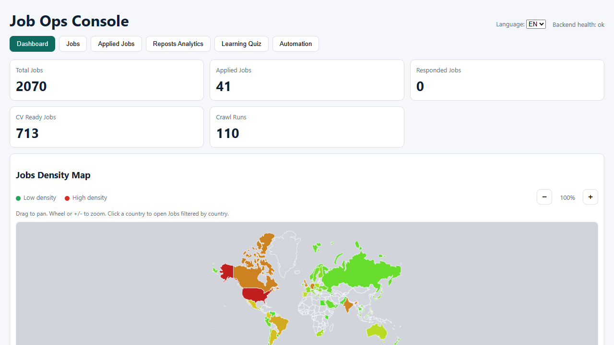
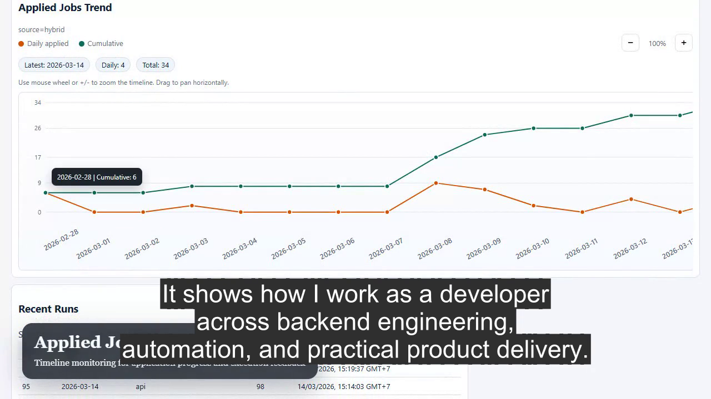
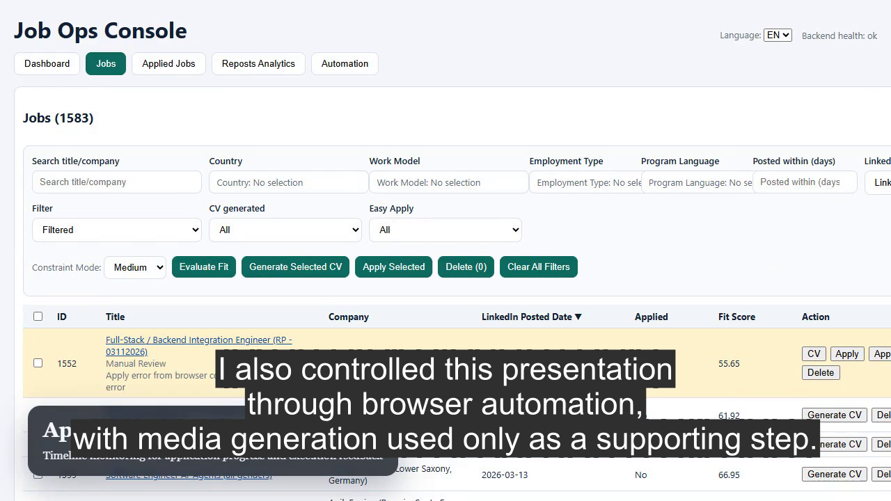
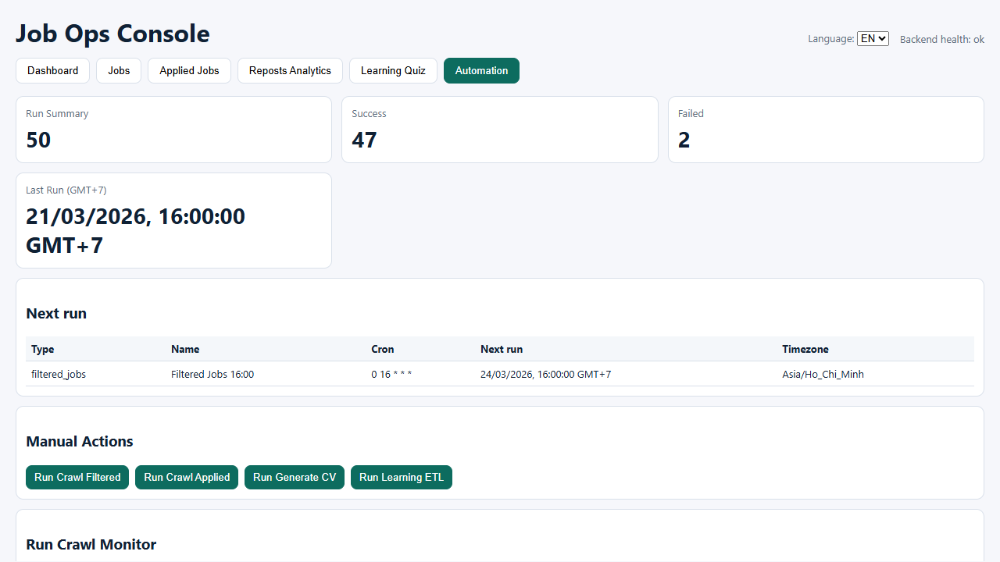

# Job Ops Console Showcase

This branch is a showcase-only presentation of **Job Ops Console**.

The production source code is intentionally kept private. This public branch exists so reviewers can quickly understand the product through a short demo video and selected screenshots, without exposing the full implementation.

## Project Summary

Job Ops Console is one of my portfolio projects and represents part of my broader experience as a developer across:

- backend engineering
- workflow automation
- practical product delivery
- browser-driven operational tooling

Automation is central to the project, from collecting job data to tracking progress in a single workflow. For this presentation, I also controlled the video creation flow itself through browser automation and scripted media generation. The narration used in the demo is synthetic and is included only for presentation purposes.

## Demo Video

- [Watch the project showcase video in this repo](showcase_assets/video/job_ops_project_showcase.mp4)
- [Public GitHub video link](https://github.com/ThanhDC-FSD/Job-Ops-Console/blob/showcase/showcase_assets/video/job_ops_project_showcase.mp4)

## Screenshots

### Dashboard Overview

### Jobs Density Map

### Jobs Workspace

### Automation Console

## Selected Code Snippets

These excerpts are intentionally partial and are provided only to show implementation style and technical depth. They are not enough to run the full application.

- [Backend API and filtering excerpt](showcase_assets/code/backend_api_excerpt.md)
- [CV generation and artifact workflow excerpt](showcase_assets/code/cv_generation_excerpt.md)
- [Frontend analytics and interaction excerpt](showcase_assets/code/frontend_analytics_excerpt.md)

## Notes

- This branch is intended for review and presentation only.
- Full source code, infrastructure details, and operational logic are not published in this repository.
- Additional technical discussion or deeper code walkthroughs can be shared separately if needed.
