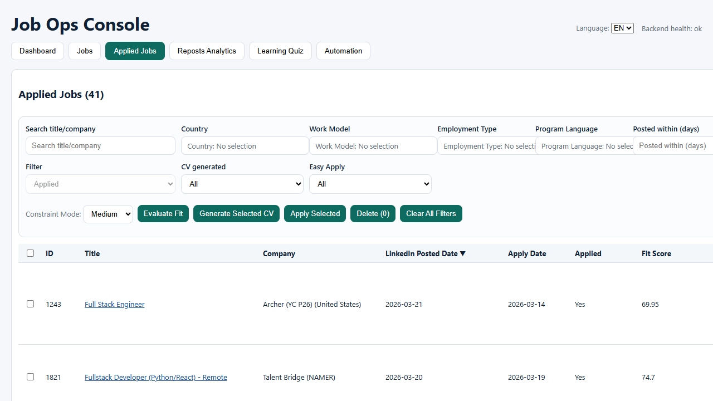
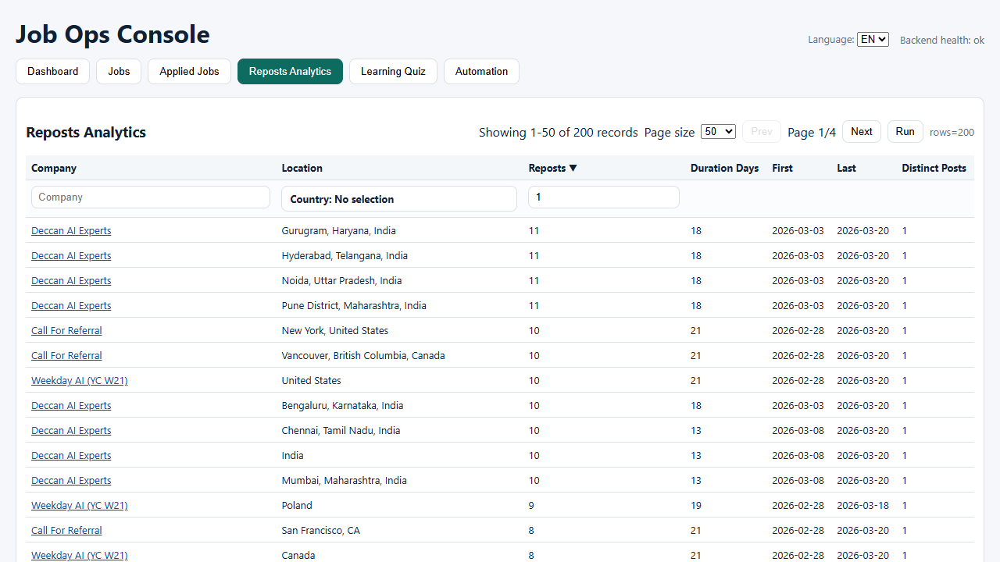
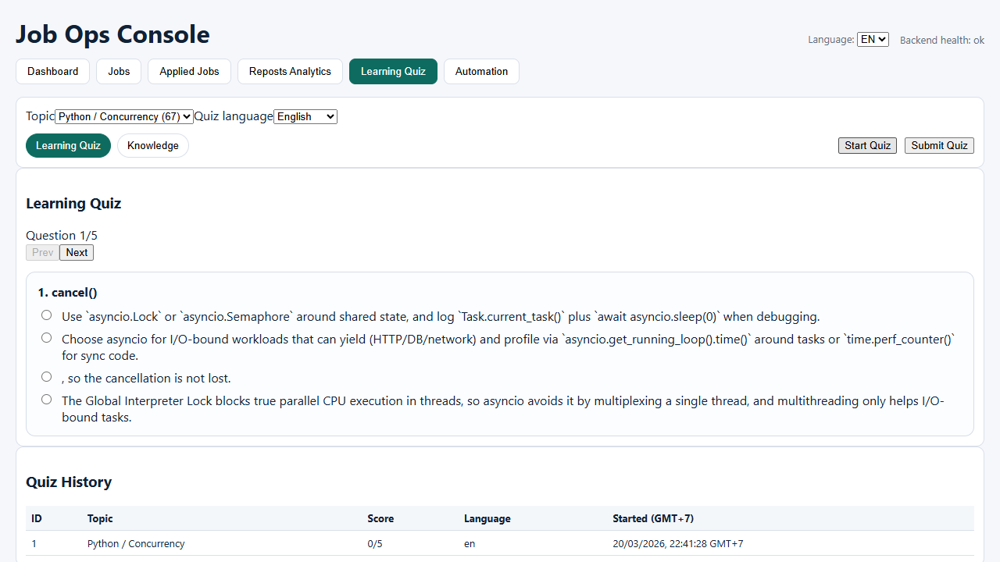
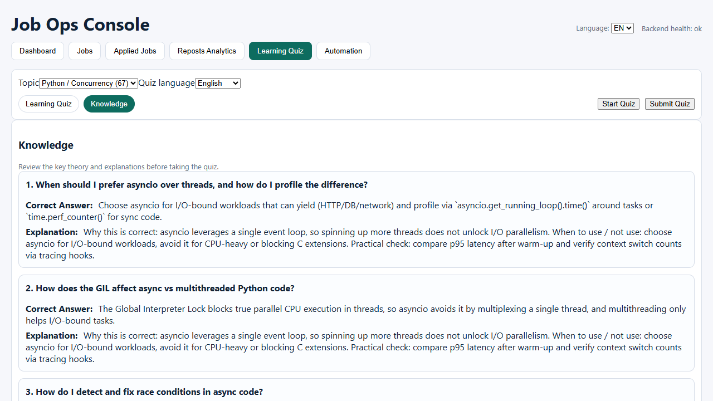

# Job Ops Console Showcase

This branch is a showcase-only presentation of **Job Ops Console**.

The production source code is intentionally kept private. This public branch exists so reviewers can quickly understand the product through a short demo video and selected screenshots, without exposing the full implementation.

## Project Summary

Job Ops Console is one of my portfolio projects and represents part of my broader experience as a developer across:

- backend engineering
- workflow automation
- practical product delivery
- browser-driven operational tooling
- local CI/CD and deployment orchestration

Automation is central to the project, from collecting job data to tracking progress in a single workflow. For this presentation, I also controlled the video creation flow itself through browser automation and scripted media generation. The narration used in the demo is synthetic and is included only for presentation purposes.

In addition to the application workflow itself, I also built a practical local deployment flow around the project: a sanitized publisher repository, a local bare Git remote, a runtime vault for sensitive files, and a scheduled Windows deployment loop that continuously syncs a stable local environment without exposing private runtime data.

## Current Workflow (As Built)

1. Crawl job pages with Playwright + HTML parsers, retain repeated observations, and normalize job metadata (URL canonicalization, role signatures, location, work model, employment type).
2. Persist operational data in SQLite (job_posts, crawl runs, embeddings, fit scores, application tracking), with periodic DB cloning to keep the API schema copy clean.
3. Run fit evaluation and rule-based gating (priority flags, Easy Apply detection, duplicates, country eligibility, constraint checks).
4. Generate artifacts through an evidence-first RAG pipeline (analysis ? evidence map ? planner ? generator ? validators ? persistence).
5. Render CV / cover letter / portfolio outputs and attach them to the job record with audit-friendly metadata.
6. Review, apply, and track outcomes inside the operator console with analytics, maps, and automation controls.

## Current Stack Snapshot

- Backend: FastAPI + Uvicorn + Pydantic, APScheduler, SQLite, httpx
- Frontend: React + Vite, D3 Geo, TopoJSON, world-atlas
- Crawl/ETL: Playwright, BeautifulSoup, structured parsers
- Retrieval/RAG: sentence-transformers + FAISS, hybrid scoring, rerank + validators, offline qwen2.5 gateway
- Ops: local bare Git remote, scheduled Windows deploy loop, sanitized publisher repo

## Demo Video

- [Watch the project showcase video in this repo](showcase_assets/video/job_ops_project_showcase.mp4)
- [Public GitHub video link](https://github.com/ThanhDC-FSD/Job-Ops-Console/blob/showcase/showcase_assets/video/job_ops_project_showcase.mp4)

The demo focuses on the end-to-end workflow: dashboard visibility, geo analytics, job review workspace, and the automation/LLM pipeline used to produce application artifacts.

## Screenshots

### Dashboard Overview

### Jobs Density Map

### Jobs Workspace

### Applied Jobs Workspace

### Analytics

### Learning Quiz

### Learning Knowledge

### Automation Console

### Workflow Steps

## Selected Code Snippets

These excerpts are intentionally partial and are provided only to show implementation style, design choices, and technical depth. They are not enough to run the full application.

- [Backend design patterns excerpt](showcase_assets/code/backend_patterns_excerpt.md)
- [Backend API and filtering excerpt](showcase_assets/code/backend_api_excerpt.md)
- [CV generation and artifact workflow excerpt](showcase_assets/code/cv_generation_excerpt.md)
- [Frontend analytics and interaction excerpt](showcase_assets/code/frontend_analytics_excerpt.md)
- [Learning quiz and knowledge workflow excerpt](showcase_assets/code/learning_quiz_excerpt.md)

## Architecture Overview

This note is intentionally written at a showcase level. It highlights the main system layers and runtime flows, including job crawling, evaluation, automation, and LLM-assisted artifact generation.

- [Project architecture overview](showcase_assets/architecture/basic_project_architecture.md)

## Notes

- This branch is intended for review and presentation only.
- Full source code, infrastructure details, and operational logic are not published in this repository.
- Additional technical discussion or deeper code walkthroughs can be shared separately if needed.


## Running & verifying the dev servers

- **Start both backend + frontend**: execute `scripts\bat\run_job_ops_all.bat start all`. The script sequentially stops any leftovers, starts `run_job_ops_backend.bat` (uvicorn on 127.0.0.1:8102) and then `run_job_ops_frontend.bat` (npm dev server on 127.0.0.1:5182). If you only need one side, run the dedicated batch file instead (`run_job_ops_backend.bat` or `run_job_ops_frontend.bat`).
- **Smoke checks**: use `curl http://127.0.0.1:8102/health` to confirm the API responds, and open `http://127.0.0.1:5182` in a browser to ensure the FE loads without CORS errors (logs in Chrome console prefixed with `[api]` show request/response details).
- **Idle job sync**: the backend scheduler now keeps a low-priority `idle_db_sync` trigger (runs every 15 minutes) that copies `input/crawled_job/linkedin_jobs_jd.sqlite` into the API/CD schema copy when there are no active automation runs. This keeps both dev/CD DBs aligned while ensuring that active jobs are always prioritized and the sync never races with ongoing ETL work. Check `apps/backend/app/logs/job_ops.scheduler.log` for "Idle DB sync" entries and for warnings when the source file is missing.
- **Offline LLM gateway**: the backend is configured to talk to a local LLM gateway (`OPENAI_BASE_URL=http://127.0.0.1:8102/v1`) for evidence-first CV/cover letter generation. If the gateway is down, the pipeline will fall back to deterministic templates and log the reason in the artifact metadata.

## CI/CD verification commands

- **Prepare schema copy**: before CI/CD runs touch the crawl DB clone with `scripts\python\clone_job_db.py --target apps\backend\app\job_ops_schema.sqlite --force`. Point `JOB_DB_PATH` (via `.env` or pipeline env) at this new file so automation and the API never fight over the original `input/crawled_job/linkedin_jobs_jd.sqlite`.
- **Backend/CD execution**: run `scripts\bat\run_job_ops_backend.bat` (with `RUN_STARTUP_BOOTSTRAP_ACTIONS=1` if you want to simulate scheduled bootstrap work) to exercise the CD-friendly service; backend logs land in `apps/backend/app/logs/backend.log`.
- **CD server host/port**: the CD-friendly Uvicorn service is bound to `127.0.0.1:8102` (mirroring `BACKEND_PORT`), so any downstream consumers or build-time smoke checks should target `http://127.0.0.1:8102` for health checks and API validation.
- **Frontend build**: run `npm run build` from `apps/frontend` to validate the CD artifact; set `VITE_API_BASE` if the backend host/port differ from 127.0.0.1:8102.

Capture the newly generated log files (`backend.log`, `backend.error.log`, `etl_runs/*.log`) and FE console output if you need to troubleshoot CI failures.

## Explanation enrichment pipeline

- Use `scripts/enrich_explanations.py` to fill missing explanations from an LLM. The script reads `learning_questions.explanation_en`/`explanation_vi`, grabs up to three `learning_question_chunks`, and writes bilingual explanations back into the database while logging provenance to `apps/backend/app/logs/explanation_enrichment.log`.
- Provide `OPENAI_API_KEY` (or `ANTHROPIC_API_KEY` and `--provider anthropic`) in your shell, then run `python scripts/enrich_explanations.py --limit 10` to process the first ten gaps. Add `--dry-run` to inspect the generated text without writing it to the DB.
- Optionally override the model names via `EXPLANATION_OPENAI_MODEL` (defaults to `gpt-4o-mini`) or `EXPLANATION_ANTHROPIC_MODEL` (defaults to `claude-3.5-opus`). The script stores provider, model, and chunk indexes in the log for auditing.
