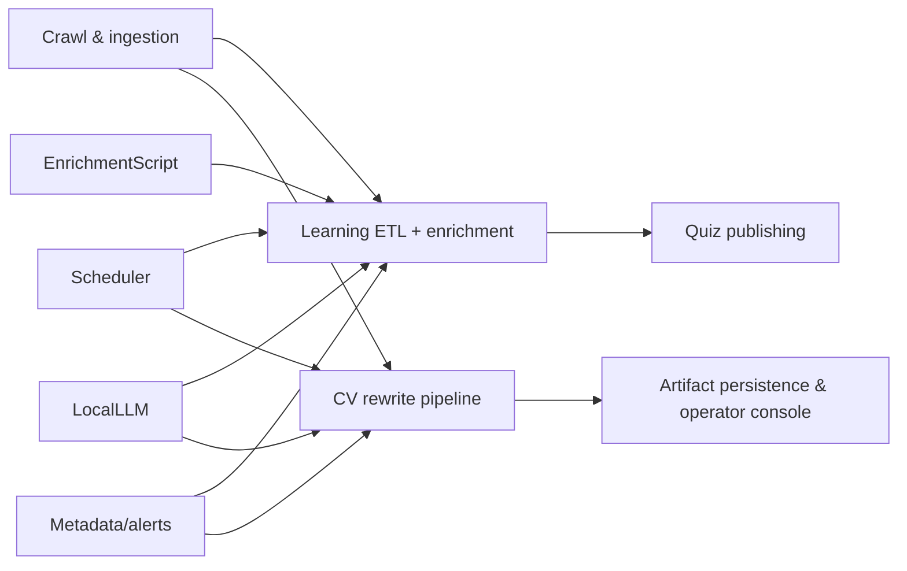
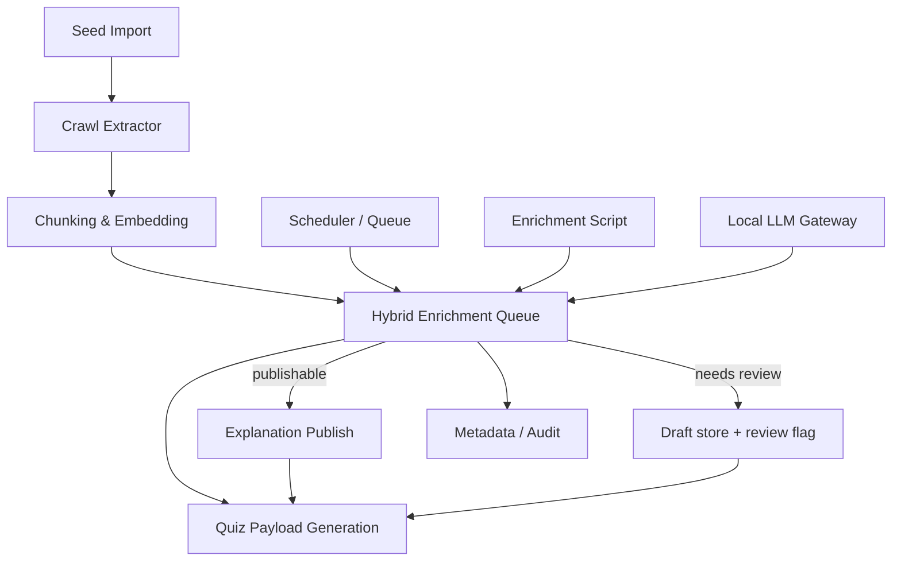

# Workflow matrix

This project runs multiple interlocking pipelines (seed ingestion, crawl, enrichment, quiz serving, scheduler). The goal of this matrix is to enumerate each workflow, describe how data flows through it, and highlight whether it uses **SLM** (small/structured models), **LLM** (larger general-purpose models), **RAG**/retrieval, or purely deterministic code.

## 1. Workflow summary table

| Workflow | Entry point | Description | Models/tech stack | RAG? | Notes |
|---|---|---|---|---|---|
| Seed import | `LearningService.import_learning_markdown` | Parses `learning_plan.md`, upserts topics/questions, builds chunks/embeddings. | Deterministic Python (no model). | ❌ | Source of canonical QA pairs. |
| Crawl extractor | `LearningService._collect_daily_crawl_candidates` | Fetches docs, heuristically finds question/answer/evidence, builds lightweight drafts. | SLM-assisted scraper (currently heuristics + evidence draft with `<why/when/profile>`). | Partial (evidence window stored for enrichment). | Gains new data to enrich, marks `needs_enrichment`. |
| Chunk + embedding store | `LearningService._upsert_crawled_item` & `split_text_chunks` | Splits text into chunks, computes `build_hashed_embedding` for retrieval. | Embedding generation via deterministic hashing + `text_vector_utils`. | ✅ Once embeddings exist, retrieval relies on stored chunks. | RAG feed for downstream enrichment. |
| Explanation enrichment (hybrid) | `_enrich_explanations` / `scripts/enrich_explanations.py` | For each candidate, run SLM prompt plan, validate info gain, optionally retry/LLM/fallback, persist metadata. | **SLM:** primary `Qwen2.5-3B` prompt-aware generation<br>**LLM fallback:** larger Qwen variant (same service) | ✅ Uses chunk context + plan hints; also sifts embeddings. | Maintains `explanation_publishable`, `information_gain_score`, `generation_stage`. |
| Deterministic fallback | `ExplanationEnrichmentService.build_domain_fallback` | If SLM/LLM fail, returns topic-specific `why/when/profile`. | None (template per topic). | ❌ | Mentions event loop, SQL explains, React profiling based on `topic_key`. |
| Quiz payload generation | `LearningService.get_quiz` / `submit_quiz` | Assembles quiz items, explanations, distractors from DB; no runtime inference. | Deterministic, uses stored metadata. | ✅ Downstream consumers can apply RAG at query time. | Works after enrichment finishes. |
| Scheduler / queue | `SchedulerRuntime`, `schedule_repository` | Runs `learning_etl` as cron via APScheduler, manages queue locking + retries. | Deterministic. | ❌ | Ensures only one learning job manipulates DB. |
| Enrichment script | `scripts/enrich_explanations.py` | Standalone batch (dry-run/real) that uses same hybrid service. | Shares SLM/LLM mix, metadata. | ✅ | Useful for manual re-runs or backfills. |
| Local LLM gateway | `local_llm_controller.py` | Provides `/v1/chat/completions` that proxies to Ollama/local endpoint with authorization. | LLM (Qwen2.5 via Ollama, fallback responses). | ✅ | Used by enrichment service when an API key or internal token is configured. |

## 2. SLM vs LLM usage per module

- **SLM-first**: Explanation enrichment runs a lean SLM prompt (Qwen2.5-3B) guided by the answer-aware planner. The goal is to cover missing dimensions (mechanism/tradeoff/profiling) before escalating.  
- **LLM fallback**: If the SLM explanation fails the information-gain validator even after a strict retry, the same pipeline requests a larger model (Qwen2.5-7B or the configured OpenAI-compatible backend) via the local gateway.  
- **Deterministic fallback**: When both SLM and LLM cannot meet the validator, templates per topic (`python_concurrency`, `sql_optimization`, `react`) provide structured explanations without inference. They still mention domain-specific mechanics, trade-offs, or profiling steps.

## 3. RAG / retrieval integration

- **Chunk storage**: Each question stores chunk metadata (text + embeddings) allowing retrieval during enrichment.  
- **Context fetching**: `_enrich_explanations` collects top-N chunks per question to feed the prompt, ensuring the explanation references specific source snippets—this is the RAG step inside enrichment.  
- **Embedding reuse**: `build_hashed_embedding` ensures chunk hashing; these embeddings can also back other retrieval-heavy workflows beyond explanation enrichment.

## 4. Additional workflows

- **Distractor generation (planned)**: While not yet hybrid, the roadmap envisions SLM-first distractor prompts with LLM fallback plus caching/validator metadata similar to explanations.  
- **Scheduler safety**: The queue ensures jobs honor feature flags (`HYBRID_ENRICH_ENABLED`, `HYBRID_PUBLISH_ENABLED`) so SLM/LLM steps can be toggled.  
- **Monitoring / audit**: Metadata fields (`explanation_generation_stage`, `explanation_rejected_reason`, `explanation_information_gain_score`) allow analytics dashboards to instrument how often SLM succeeded vs fallback.

## 5. Implementation notes

- Use `.env` to point `EXPLANATION_OPENAI_MODEL` to the desired SLM and set `INTERNAL_LLM_SHARED_TOKEN` to authorize the local gateway.
- The enrichment service (shared by API and scripts) centralizes planning, validation, and SLM→LLM fallback so every workflow reuses the same hybrid cascade.
- Adding new topics just extends `DOMAIN_FALLBACKS`, keeping deterministic fallbacks domain-aware.

## 6. CV rewrite + artifact generation workflow

There is a second major production workflow: CV/rewrite artifact generation. It is orchestrated by `CvRewriteService` and the `local_llm_controller` gateway, and it blends structured preprocessing + RAG retrieval with both SLM and stronger LLM stages.

### Components
- **JD/evidence analyzer**: deterministic extraction from stored job descriptions and operator inputs, producing `jd_analysis`, `evidence_map`, `fit_assessment`.  
- **Planner/SLM pass**: uses lite Qwen2.5 or llama3.2 (SLM) to rewrite CV bullets based on evidence, obeying a structured JSON contract.  
- **Validator**: compares diff/coverage, ensures each bullet cites evidence IDs, tracks metrics like `cv_enhanced`.  
- **LLM fallback**: if the SLM rewrite fails coverage or validation, the pipeline reroutes through a larger LLM (Qwen2.5-7B/OpenAI-like) using the same local gateway and `INTERNAL_LLM_SHARED_TOKEN`.
- **Deterministic fallback**: fallback templates generate safe copy with placeholders referencing evidence if both models fail.
- **Artifact persistence**: outputs (CV text, cover letter, portfolio snippet) plus metadata (model/prompt names, reason codes) are stored under `job_generated_artifact_sets`.

### RAG + retrieval
- **Retrieval filters**: topic, visa, location, and freshness metadata filter retrieval results before merging semantic/keyword scores.  
- **Evidence map**: ensures rewritten CV references specific JD IDs/paragraphs (RAG output).  
- **Fallback guard**: the pipeline enforces `cv_enhanced` only when diff thresholds and validator scores exceed configured cutoffs.

### Full CV rewrite flow (end-to-end)

1. **Ingestion**: job pages crawled, JDs extracted, normalized, and stored.  
2. **Evidence preparation**: JD analysis + evidence map created for each job.  
3. **Retrieval**: RAG retrieves top-k JD snippets and historical CV evidence.  
4. **Planning**: planner enumerates missing skills/impact gaps and target bullets.  
5. **SLM rewrite**: SLM produces structured JSON (`cv_rewrite`, `cover_letter`, `quality_checks`).  
6. **Validation**: verify evidence ID coverage, diff thresholds, and `cv_enhanced`.  
7. **LLM fallback**: if SLM fails or low-confidence, rerun with larger LLM.  
8. **Deterministic fallback**: if both models fail, apply domain template.  
9. **Persistence**: store artifacts + metadata in `job_generated_artifact_sets`.  
10. **Operator console**: serve the newest publishable artifacts to UI.

### Workflow diagram

```mermaid
flowchart TD
    CrawlJD[Job crawl + JD extract] --> Normalize[Normalize + dedup]
    Normalize --> Analyze[JD analysis + evidence map]
    Analyze --> Retrieve[RAG retrieve top-k snippets]
    Retrieve --> Plan[Planner + target bullet map]
    Plan --> SLM[SLM rewrite (Qwen2.5-3B / llama3.2)]
    SLM --> Validate{Validator}
    Validate --> Pass[Pass -> Persist artifacts + metadata]
    Validate --> Fail[Fail -> LLM fallback]
    Fail --> LLM[LLM rewrite (Qwen2.5-7B / OpenAI)]
    LLM --> Validate
    Validate -->|still fail| Fallback[Deterministic template]
    Fallback --> PersistDraft[Persist draft + fallback metadata]
    Pass --> Publish[Publish latest artifacts to console]
    PersistDraft --> Publish
```

## 7. Full workflow coverage diagram



## 8. Validation notes (latest run)

- "asyncio vs threads" explanation now runs through the hybrid enrichment flow and produced a domain-aware fallback explanation mentioning event loops, I/O vs CPU trade-off, and profiling guidance. It is marked `publishable=true` with metadata (`information_gain_score`, `dimensions_present`, `generation_stage`).
- Ran `scripts/enrich_explanations.py --limit 1 --dry-run` to confirm the offline gateway accepts requests and the script handles publish/draft bookkeeping.
- Re-ran a targeted service call with `-X utf8` to inspect JSON output and confirm the explanation is not just a paraphrase but adds missing educational dimensions.
## 6. Workflow diagrams

### Hybrid enrichment + publish pipeline



### Explanation generation + validation detail

```mermaid
flowchart TD
    Candidate[Candidate question] --> Retrieve[RAG: retrieve top-k chunks]
    Retrieve --> Plan[Plan answer concepts + missing angles]
    Plan --> SLM[SLM prompt generator (Qwen2.5-3B)]
    SLM --> Validate{Validator}
    Validate --> Match[✅ info gain + dimensions]
    Validate --> Fail[❌ needs stronger signal]
    Fail --> Retry[Strict SLM retry / escalate to LLM]
    Retry --> Validate
    Retry -->|still fail| Fallback[Domain-aware deterministic template]
    Match --> Publish[Persist publishable explanation + metadata]
    Fallback --> Draft[Persist draft + needs_review, publishable=0]
```
