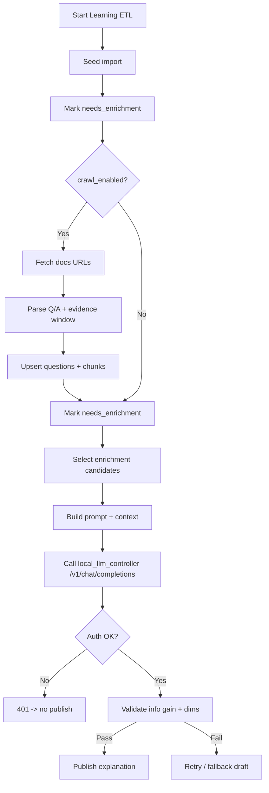
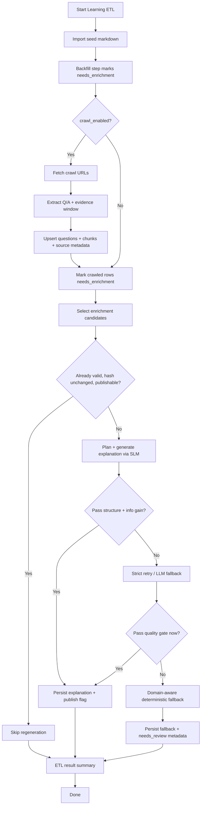
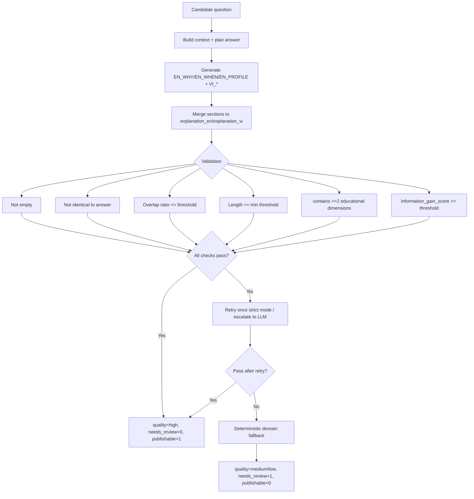

# Crawl Knowledge Pipeline (Explanation Quality Fix)

## Why explanation quality was bad before

Root causes in previous flow:

1. Missing explanation was backfilled by copying `answer_*` into `explanation_*`.
2. Crawl parser generated weak placeholder explanation text.
3. Enrichment existed as a detached script and was not guaranteed in ETL.
4. No strict validation blocked low-value explanations.

Result: many explanations were identical or near-identical to correct answers.

---

## What has been changed

## 1) Direct answer -> explanation copying removed

`LearningService._backfill_theory_from_answers` no longer copies answer into explanation.

New behavior:

- marks record as `needs_enrichment` (stored via explanation metadata),
- leaves real explanation generation to mandatory enrichment step.

---

## 2) Enrichment is now mandatory in ETL

Main ETL flow (`run_learning_etl`) now runs:

1. seed import,
2. crawl import,
3. mandatory explanation enrichment (`_enrich_explanations`).

Enrichment candidates include rows with:

- missing explanation,
- low-quality explanation,
- high overlap with answer,
- explicit review flag.

---

## 3) Prompt contract upgraded

Explanation generation now enforces structured output:

- `EN_WHY:`
- `EN_WHEN:`
- `EN_PROFILE:`
- `VI_WHY:`
- `VI_WHEN:`
- `VI_PROFILE:`

Prompt explicitly forbids:

- verbatim answer repetition,
- one-line paraphrase.

Prompt requires educational value:

- why answer is correct,
- when to use / not use,
- practical verification/profiling guidance.

---

## 4) Explanation quality gate added

Before persistence, explanation is validated with minimum gates:

1. non-empty explanation,
2. not identical to answer,
3. overlap ratio below threshold,
4. minimum length threshold,
5. contains educational signal (`why`, `because`, `when`, `however`, `trade-off`, `profiling`, `benchmark`, etc.),
6. bilingual structural sanity (VI optional, but validated when present).

If gate fails:

1. retry once with stricter prompt,
2. if still failing, use deterministic structured fallback,
3. mark quality/review metadata.

---

## 5) Crawl extraction explanation behavior improved

Crawler no longer stores placeholder text like:

- `"This answer is derived from ..."`

New crawl behavior:

1. captures larger local evidence window,
2. builds concise answer candidate,
3. creates structured explanation draft (`why/when/profile`),
4. stores provenance in metadata (`parser_version`, `evidence_window`) instead of explanation body.

---

## 6) Quality metadata added for audits

`learning_questions` now tracks:

- `explanation_quality`
- `explanation_generated_by`
- `explanation_prompt_version`
- `explanation_overlap_ratio`
- `explanation_needs_review`
- `explanation_input_hash`

Purpose:

- trace generation source,
- identify low-quality rows,
- avoid unnecessary regeneration when input hash is unchanged.

---

## 7) Local-machine friendly behavior

Implementation keeps local constraints in mind:

- small batch caps,
- chunk cap for context retrieval,
- one retry max,
- deterministic fallback available,
- skip regeneration when valid explanation hash matches current input.

---

## Files updated for this fix

1. `apps/backend/app/services/learning_service.py`
2. `apps/backend/app/services/explanation_enrichment_service.py` (new)
3. `apps/backend/app/repositories/learning_repository.py`
4. `apps/backend/app/repositories/meta_repository.py`
5. `scripts/enrich_explanations.py`

---

## Workflow overview + hybrid stack

The learning quiz pipeline now combines SLM-first enrichment with LLM fallback to keep both speed and quality. Each module shares metadata so handlers know whether the published explanation came straight from the SLM, from a retry, or from a domain-aware fallback.

### Stack summary
- **Seed / normalization / dedup**: deterministic code feeds `learning_plan.md` into the DB.
- **Crawl extractor**: SLM (Qwen2.5-3B) builds candidate Q/A + evidence drafts and tags topic metadata.
- **Chunking / embeddings**: uses the structured draft to build chunk store and lightweight embeddings.
- **Hybrid enrichment queue**:
  1. SLM primary generation guided by the answer-aware planner.
  2. Validator enforces structure, overlap, information gain, and missing educational dimensions.
  3. Failing SLM outputs retry with stricter prompt or escalate to a larger LLM before fallback.
- **Domain-aware fallback**: topic-specific `why/when/tip` templates keep fallback meaningful.
- **Publishing gate**: only explanations marked `explanation_publishable=1` enter quiz_payloads; others stay drafts needing review.

## Chi tiet luong crawl knowledge (end-to-end)

Muc tieu: tu URL tai lieu -> Q/A + explanation draft -> enrichment -> API knowledge -> UI.

1. **ETL entrypoint**: `LearningService.run_learning_etl` chay theo lich (`/api/automation/learning-etl/enqueue`).  
   File: `apps/backend/app/services/learning_service.py`.  
   Thu tu: seed import -> backfill `needs_enrichment` -> crawl -> enrichment.

2. **Chon nguon crawl**: `_collect_daily_crawl_candidates` lay `TOPIC_SOURCES` hoac override tu payload (`crawl_sources`).  
   File: `apps/backend/app/services/learning_service.py`.  
   Tham so lien quan: `crawl_enabled`, `crawl_per_topic_limit`, `topic_keys`.

3. **Fetch HTML**: `_fetch_url_text` dung `httpx` tai trang, follow redirect, skip 404, cat toi da 300k ky tu.  
   File: `apps/backend/app/services/learning_service.py`.

4. **Parse Q/A + evidence**: `_extract_qa_from_text`.  
   Noi dung: strip `<script>/<style>`, remove HTML tags, normalize lines; nhan dien cau hoi bang prefix; lay cau tra loi tu 1-7 dong ke tiep co do dai > 30; tao `evidence_window` (toi da 4 dong); build explanation draft qua `_build_crawl_explanation_draft` theo khung `why/when/profile`.

5. **Upsert DB**: `_upsert_crawled_item`.  
   Noi dung: upsert `learning_sources` (parser_version, evidence_window); upsert `learning_questions` (question, answer, explanation draft); replace `learning_answers` + `learning_question_chunks` va tao embedding/chunk; mark `explanation_needs_review=1`.  
   File: `apps/backend/app/services/learning_service.py`, `apps/backend/app/repositories/learning_repository.py`.

6. **Enrichment bat buoc**: `_enrich_explanations`.  
   Noi dung: lay candidate tu `list_questions_for_explanation_enrichment`; generate explanation theo `EN_WHY/EN_WHEN/EN_PROFILE + VI_*`; validate overlap/length/info gain/dimensions; fail thi retry hoac fallback; **chi khi `explanation_publishable=1` moi ghi vao `explanation_en`/`explanation_vi`**.  
   File: `apps/backend/app/services/explanation_enrichment_service.py`.

7. **API knowledge**: `GET /api/learning/knowledge` goi `LearningService.get_topic_knowledge`.  
   Tra `explanation_en`/`explanation_vi` truc tiep tu `learning_questions`.  
   File: `apps/backend/app/controllers/learning_controller.py`.

8. **UI hien thi**: tab Knowledge dung `pickLang(...) || item.explanation || '-'`.  
   Neu explanation rong -> UI hien thi dau `-`.  
   File: `apps/frontend/src/App.jsx`.

## Vi sao UI hien thi `Explanation: -`

Dieu kien thuc te de ra dau `-` la **ca `explanation_en` va `explanation_vi` deu rong** tai thoi diem API tra ve.

Cac nguyen nhan thuong gap:

1. **Backfill khong con copy answer**: `_backfill_theory_from_answers` chi danh dau `needs_enrichment`, khong dien explanation. Neu enrichment chua chay hoac fail -> explanation trong.  
   File: `apps/backend/app/services/learning_service.py`.

2. **Enrichment chay nhung khong publishable**:  
   `update_question_explanation` chi ghi vao `explanation_*` khi `explanation_publishable=1`. Neu ket qua bi fail gate, chi `explanation_*_draft` duoc cap nhat, UI khong doc draft -> van `-`.  
   File: `apps/backend/app/repositories/learning_repository.py`.

3. **Upsert tu nguon khac co explanation rong**:  
   `upsert_question` nhan `explanation_en=''`/`explanation_vi=''` co the overwrite du lieu cu neu nguon ingest khong tao draft.  
   File: `apps/backend/app/repositories/learning_repository.py`.

Goi y debug nhanh (DB):

- `learning_questions.explanation_en`, `learning_questions.explanation_vi` (dang trong?).  
- `learning_questions.explanation_en_draft` (co draft nhung chua publish?).  
- `learning_questions.explanation_publishable`, `explanation_rejected_reason`, `explanation_generation_stage`.

## Phan tich su co thuc te (log 401 + 404)

Quan sat log hien tai:

- `apps/backend/app/logs/backend.log` ghi nhan nhieu lan goi `POST /v1/chat/completions -> 401` vao khoang **2026-03-21 22:59:32-22:59:39** va **2026-03-21 23:26:19-23:26:24**.  
- `apps/backend/app/logs/backend.error.log` ghi nhan crawl FastAPI URL cu bi 404 (advanced/async-sql-databases) trong ngay **2026-03-20**.

Ket luan:

1. **Enrichment khong nhan duoc LLM output** vi local_llm_controller tra 401, dan den explanation khong publish.  
   Nguyen nhan goc: `INTERNAL_LLM_SHARED_TOKEN` trong env runtime bi rong, trong khi gateway yeu cau token.  
   Fix da ap dung: doc `.env` neu env rong va ep base_url ve local_llm_controller.

2. **Crawl FastAPI bi thieu** do URL cu 404.  
   Fix da ap dung trong code: map URL cu sang URL moi trong `_fetch_url_text`.

3. **Queue bi treo**: `schedule_queue` co item `status=running` treo qua nhieu gio, lam scheduler khong claim item moi.  
   Fix da ap dung: `claim_next_queue_item` tu dong danh dau stale `running` thanh `failed` neu qua thoi gian `QUEUE_STALE_MINUTES` (mac dinh 60 phut).  
   Tieu chi stale dua vao `updated_at` (heartbeat) neu co, fallback ve `started_at`.

## Kiem tra job running co "song" hay khong

Co 2 cach nhanh:

1. **API queue**: `GET /api/automation/queue?limit=5`  
   Theo doi:
   - `status=running` va `updated_at` cap nhat lien tuc -> job dang hoat dong.  
   - `result_json.progress` neu co se cho biet `stage` (seed_import_done, crawl_done, enrich_progress, enrich_done, ...).

2. **Log realtime**: `apps/backend/app/logs/backend.log`  
   - Neu thay cac dong `job_ops.local_llm` hoac `HTTP Request: GET ...` => job dang chay.  
   - Neu log dung > 60 phut, queue se bi fail voi `error_text=stale_running_timeout`.

### Tham so dieu khien queue

- `QUEUE_STALE_MINUTES` (mac dinh 60): qua thoi gian nay, running item se bi force fail.  
- `LEARNING_QUEUE_PROCESSOR_ENABLED` (mac dinh 1): set `0` de tat queue processor.  
- `LEARNING_QUEUE_POLL_MINUTES` (mac dinh 1): khoang cach poll queue (phut).

## Trang thai chay hien tai (2026-03-22 07:40+07)

- `queue_id=26` (learning_etl) dang `running`, `started_at=2026-03-22 07:36:00+07`, chua co `finished_at`.
- `backend.log` cho thay `local_llm_controller` da auth OK va tra `200` cho `/v1/chat/completions` (gateway_ollama_chat).
- API mau: `GET /api/learning/knowledge?topic_key=python_concurrency&limit=3` tra ve `explanation_en`/`explanation_vi` = `""` -> **chua publish**, UI se hien `-`.

Y nghia:

- Neu job chua ket thuc thi explanation van co the chua publish.
- Neu job ket thuc ma van `-`, kiem tra `explanation_publishable` va `explanation_*_draft` de biet co bi fail gate hay khong.

## Luong chi tiet (cap nhat, chi dung local_llm_controller)

### 1) Full hybrid ETL workflow

### 2) Explanation quality gate workflow

---

## Why structural validation alone was not enough

Structural checks stopped the worst cases (empty or identical explanations) but still allowed outputs that only paraphrased the answer. Without understanding “what the answer already says,” the pipeline could not detect missing educational dimensions like mechanism, trade-offs, or profiling guidance.

## Information-gain validator + answer-aware planning

The new pipeline first plans what the answer covers (`answer_concepts`) and which dimensions are missing (`missing_angles`). The prompt now tells the model to focus on the missing angles and avoid repeating the answer. A lightweight heuristic validator computes:

- `information_gain_score` (new unique tokens + dimension bonus),
- `dimensions_present` (mechanism/tradeoff/profiling/pitfall),
- whether at least two dimensions are present and one is novel compared to the answer.

If the score or dimension count is too low, the explanation is rejected, retried once in strict mode, and only marked publishable when the validator passes.

## Publish policy + metadata hardening

Publishing now requires every gate to pass. If not:

- the explanation stays in `explanation_en_draft`/`explanation_vi_draft`,
- `explanation_publishable` stays `0`, `needs_review` is raised, and `explanation_rejected_reason` captures the validator failure,
- quiz payloads continue to read the last publishable explanation.

New metadata fields (`explanation_information_gain_score`, `explanation_dimensions_present`, `explanation_publishable`, `explanation_rejected_reason`, `explanation_generation_stage`) support analytics + audit.

## Domain-aware deterministic fallback

When even the strict retry fails, the deterministic fallback switches on domain templates. Each topic (python_concurrency, sql_optimization, react, …) now has a tailored `WHY / WHEN / TIP` trio that mentions the relevant mechanism/trade-off/profiling advice so the fallback is not generic.

## Implementation status

- Explanation information-gain validator, answer-aware planning, and metadata gating are implemented (see `explanation_enrichment_service.py`, `learning_service.py`, `learning_repository.py`, `scripts/enrich_explanations.py`).
- Documentation, workflow diagrams, and audition support all reflect the new policy (this file).

