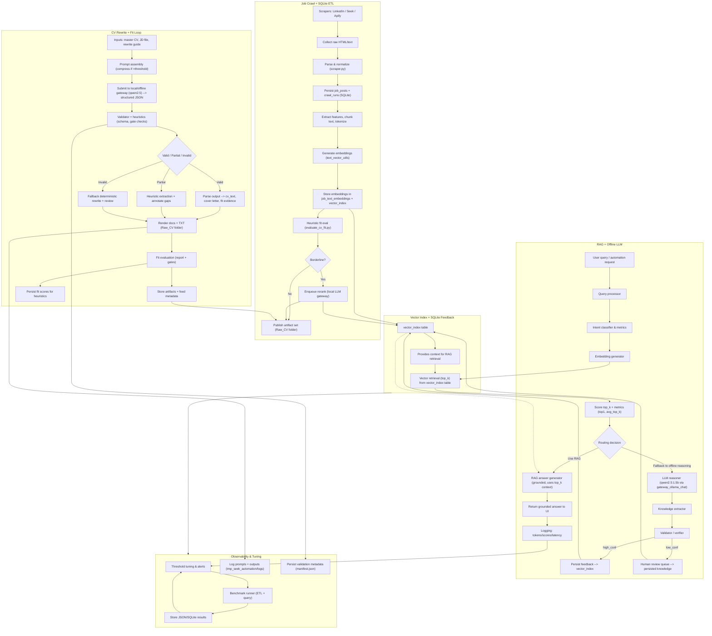

# RAG Workflow Reference

This document summarizes the automated RAG workflow captured in `docs/rag_workflow.mmd`. The diagram below is a literal transcription of that file so you can study it without switching viewers.

## Complete diagram (from `rag_workflow.mmd`)

## Detailed walkthrough

### 1. Job Crawl + SQLite ETL

1. **Scrapers** (`C1`) orchestrate three harvest channels—LinkedIn, Seek, and Apify—so that the system can compare surface area, rate limits, and data richness across providers. Each scrape job pushes raw HTML blocks and associated metadata (response headers, timestamps, proxy info) into the pipeline (`C2`).
2. **`scraper.py`** (`C3`) applies parser rules and normalization: HTML is parsed into fields such as title, company, location, salary hints, JD paragraphs, and the crawl run payloads (`crawl_id`, `source`). The parser also cleans noise (ads, markup fragments) and standardizes field names so downstream heuristics can rely on consistent keys.
3. Normalized documents are inserted into SQLite tables (`C4`). The schema stores `job_posts` (text blobs, structured attributes) plus `crawl_runs` (id, timestamp, source, status). This dual storage makes it easy to attribute every job to the crawl that produced it.
4. The textual content is chunked (sliding window) and tokenized (`C5`). Feature extraction adds metadata like part-of-speech counts, relevance to CV sections, and binary flags (e.g., remote-friendly). The chunked segments are enriched with heuristics so that a single job may produce multiple embeddings.
5. Embeddings are generated by `text_vector_utils` (`C6`) and stored in both `job_text_embeddings` (embedding vectors, metadata) and the global `vector_index` (`C7`). A heuristic fit evaluation script (`evaluate_cv_fit.py`) examines fit signals (skill overlap, location match) and flags borderline cases (`C8`).
6. Borderline items are enqueued for reranking by a local LLM gateway (`C11`), either to confirm fit or surface missing evidence. When fit is solidified—either on first pass or after rerank—the artifacts (raw CV drafts, scoring metadata, reranked snippets) are published into `Raw_CV` for downstream reporting (`C10`).

### 2. Vector Index + SQLite Feedback

- The vector index table (`V1`) is the canonical retrieval store, aggregating embeddings from cleanly fit jobs (`C7`) and reranked/validated examples (`C11`) so that the same semantic space backs both retrieval and learning loops.
- Retrieval context (`D1`) pulls from `V1` and feeds the RAG flow (`R5`). It also doubles as the feedback repository: high-confidence validated output re-enters the index (`R13`) while low-confidence material is human-reviewed (`R14`) before persistence, ensuring quality control.
- Because the vector index references SQLite metadata, every embedding retains traceability to the original job post and crawl run.

### 3. RAG + Offline LLM

1. User queries or automation requests (`R1`) first go through a lightweight query processor (`R2`) that normalizes inputs, enforces rate limits, and determines downstream signals (intent, urgency, required expertise, metrics).
2. The intent classifier and metrics layer (`R3`) instructs an embedding generator (`R4`) which vectorizes the query and sends it to the vector index (`R5`). Retrieval is top-k with similarity scoring plus feature-based filtering (freshness, recency, brand match).
3. Retrieved candidates are rescored (`R6`) across metrics such as top1 relevance and average top-k coherence. A routing decision (`R7`) then chooses between RAG generation (`R8`) or offline reasoning (`R9`); fallback occurs when the retrieval set fails confidence thresholds or matches policy constraints.
4. Grounded answers (`R8`) are returned to the UI along with provenance, while the offline Qwen2.5 agent (`R9`) acts as an LLM reasoner for tougher cases. All responses log latency and scoring data via `M1`.
5. Knowledge extraction (`R11`) pulls structured findings and signals that feed the validator/verifier (`R12`). High-confidence determinations update the vector index immediately (`R13`); uncertain cases route through a human review queue where reviewers confirm or correct before the result is persisted (`R14`).

### 4. CV Rewrite + Fit Loop

1. The rewrite loop starts with the master CV, a job description (JD) file, and a rewrite guide (`W1`). These inputs determine persona, tone, evidence, and target metrics.
2. Prompt assembly (`W2`) compresses content when token limits are exceeded and merges the CV, JD, and guide into a single structured prompt that is submitted to the local/offline gateway (`W3`). The gateway returns a structured JSON response that includes segmented drafts and metadata.
3. Validator/heuristic checks (`W4`) evaluate schema correctness, gate outputs for hallmarks (plagiarism, hallucinations), and tag gaps. Depending on the result, the output is marked Valid, Partial, or Invalid (`W5`).
4. Valid outputs are parsed into final assets (`cv_text`, cover letter, fit evidence) (`W6`). Partial outputs trigger heuristic extraction to document existing strengths and annotate missing evidence (`W7`). Invalid runs fall back to a deterministic rewrite process with additional review (`W8`).
5. Rendered artifacts (`W9`) are archived in `Raw_CV`, then fit evaluation (`W10`) runs report generation, gate checks, and score assignment. Artifacts and metadata (`W11`) are stored alongside crawl outputs, and fit scores feed `V2` so heuristics can learn from new examples. The validated artifacts also feed the main publish step (`C10`) to keep everything coordinated.

### 5. Observability & Tuning

- Logging from telemetry (`M1`) populates threshold tuning and alert rules (`M2`). These tuned thresholds adjust routing, reranking sensitivity, and validator gates so the system can self-correct.
- Benchmark runners (`B1`) execute synthetic ETL and query workloads, storing JSON/SQLite results (`B2`) that help calibrate throughput, cost, and accuracy curves. Those artifacts feed back into tuning (`M2`) for a closed observability loop.
- Rewrite outputs (`W9`) and validator metadata (`W4`) are specifically logged (`L1`, `L2`) so you can rehydrate prompts, reproduce gate decisions, and replay failure cases during audits or retraining sessions.

### Cross-domain connections

- The vector index still serves RAG generation by providing the context window; even though vector storage is “below” the rewriting loop, it loops back into RAG via a dotted connector (`V1 -.-> R8`).
- Observability interacts with Vector to ensure tuning, benchmarking, and logging remain synchronized (`Vector --> Observability`).

### Local execution environment

- **Hardware (per latest notes):** Intel Core i5 CPU, ~4 GB RAM, consumer-grade storage, consumer-level network (4G) tether. This constrained footprint makes lightweight local/offline LLMs (e.g., Qwen2.5 1.5B) a practical choice and discourages large multicore/32 GB memory models.
- **LLM permissions/operations:** The local gateway only permits licensed offline reasoning; data (CVs, JDs, artifacts) never leaves the machine. Reranking and reasoning jobs are queued to that gateway, so the workflow respects the “no external API” constraint while still enabling rerank/fallback logic.
- **Implications:** Keep prompts token-efficient, reuse cached embeddings where possible, and schedule heavier workloads (benchmarking, reranking) during times when 4G bandwidth and CPU heat are less constrained. This section documents the environment that the Mermaid workflow is tuned for.
- **Auto-shutdown control:** The automation service now issues a Windows `shutdown` command after each scheduled ETL run if `AUTO_SHUTDOWN_AFTER_ETL` is enabled (customizable with `ETL_SHUTDOWN_DELAY_SECONDS` and `ETL_SHUTDOWN_MESSAGE`), so the 16:00 run can bring the workstation down automatically without extra steps.

Use this document alongside `docs/rag_workflow.mmd` whenever you want a verbal walk-through or need to keep the Mermaid definition in sync. 

### Operational schedule & cutoff

- **Run windows:** Schedule both the new actions (`Run Crawl Filtered` and `Run Crawl Applied`) to start automatically at **16:00 GMT+7** (UTC+7) so that the daily ETL window aligns with your previous runs. This can also be enforced by triggering the API endpoints (`POST /api/actions/run-crawl-filtered` and `/api/actions/run-crawl-applied`) at that local time when you need manual control.
- **Cutoff rule:** Once the ETL pipeline finishes each day, shut down the workstation (or stop the runner) so the local environment is quiescent overnight.
- **Manual control past cutoff:** After 16:00/ETL completion, do _not_ trigger any automated crawls or ETL tasks unless you explicitly request a manual rerun. The workflow assumes no unattended crawls post-cutoff, which keeps the 4G tether and CPU usage under control.
- **Action endpoints:** You can trigger the two ETL flows manually via the API (`POST /api/actions/run-crawl-filtered` and `POST /api/actions/run-crawl-applied`), each accepting an optional `args` array that maps directly to the underlying `.bat` scripts. When these endpoints are used from the scheduler, the automation service honors the `AUTO_SHUTDOWN_AFTER_ETL` flags so the Windows shutdown command is issued as soon as the filtered/applied crawl process exits.

### Cross-domain connections
- The vector index gives contextual input to the RAG generator (`V1 -.-> R8`) and bubbles observability insights into tuning dashboards (`Vector --> Observability`).

Use this document alongside `docs/rag_workflow.mmd` whenever you want a verbal walk-through or need to keep the Mermaid definition in sync. 
