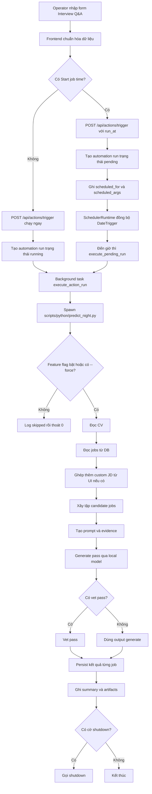

# 10.2 Workflow `predict_interview_qa`

## Mục đích tài liệu

Tài liệu này mô tả workflow của subpage `Learning Quiz -> Interview Q&A` và chốt hướng triển khai pipeline crawl + xử lý tối ưu cho máy cấu hình yếu.

Mục tiêu của bản cập nhật này là giữ cùng lúc hai góc nhìn:

1. workflow vận hành hiện tại của action `predict_interview_qa`
2. pipeline kỹ thuật nên triển khai tiếp để giảm CPU, RAM, I/O, và chi phí LLM

Tài liệu tổng quan hệ thống nằm tại:

- [10.1_current_system_explanation.md](d:/5.Thanh/2.automate_updating_CV/docs/10.1_current_system_explanation.md)
- [10.1_current_system_explanation.mmd](d:/5.Thanh/2.automate_updating_CV/docs/10.1_current_system_explanation.mmd)

## 1. Bài toán nghiệp vụ

Subpage `Interview Q&A` phục vụ hai kiểu chạy:

1. `Ad-hoc prediction`: operator nhập nhanh job, CV, JD text hoặc JD file để chạy ngay
2. `Scheduled prediction`: operator đặt `run_at` để hệ thống chạy sau bằng `automation_runs` + scheduler

Đầu ra kỳ vọng không phải là crawl tràn lan, mà là tạo bộ evidence gọn và đáng tin để trả lời:

- công ty làm gì
- sản phẩm hoặc dịch vụ chính là gì
- khách hàng mục tiêu là ai
- có dấu hiệu nhu cầu thị trường nào
- bằng chứng nào hỗ trợ các kết luận đó

Nguyên tắc vận hành trên máy yếu:

- crawl ít nhưng đúng
- lọc sớm
- chỉ dùng LLM ở bước cuối
- ưu tiên text sạch, tránh render JS hoặc parse PDF sớm

## 2. Input hiện có từ UI

UI hiện có các trường:

- `Job IDs`
- `CV path`
- `Recent days`
- `Max jobs`
- `Start job time`
- `JD text`
- `JD file`
- `Force run even when feature flag is off`
- `Shut down when completed`

## 3. Ánh xạ input UI -> payload / args

| Input UI | Chuẩn hóa ở frontend | Đầu ra gửi backend / script | Ghi chú |
|---|---|---|---|
| `Job IDs` | tách dấu phẩy, trim, ép số, bỏ giá trị lỗi | lặp lại `--job-id <id>` | chỉ giữ số dương hợp lệ |
| `CV path` | trim chuỗi | `--cv-path <path>` | để trống thì script dùng mặc định |
| `Recent days` | ép về số nguyên không âm | `--recent-days <n>` | dùng khi không có hoặc không đủ `Job IDs` |
| `Max jobs` | ép về số nguyên tối thiểu `1` | `--limit <n>` | giảm số job phải load và xử lý |
| `Start job time` | `datetime-local` -> ISO UTC | `run_at` trong payload API | backend tạo pending run nếu có giá trị |
| `JD text` | trim rồi encode base64 | `--jd-text-base64 <encoded>` | tránh log raw JD trên command line |
| `JD file` | browser đọc file thành text | hợp nhất vào luồng `JD text` | chưa đẩy file path thô xuống backend |
| `Force...` | boolean | `--force` | bỏ qua feature gate |
| `Shut down...` | boolean | `--shutdown-when-completed` | cờ vận hành nhạy cảm, phải dùng cẩn thận |

## 4. Workflow vận hành hiện tại



## 5. Các pha xử lý hiện tại

### 5.1 Frontend chuẩn hóa dữ liệu

Frontend thực hiện các bước:

1. chuẩn hóa `Job IDs` thành nhiều cặp `--job-id`
2. thêm `--cv-path` nếu có
3. luôn gửi `--recent-days` và `--limit` sau khi ép kiểu
4. hợp nhất `JD text` và `JD file` thành text, rồi encode base64 qua `--jd-text-base64`
5. đổi `Start job time` sang `run_at` ISO UTC
6. bật `--force` hoặc `--shutdown-when-completed` theo checkbox

### 5.2 Backend tạo run và đồng bộ scheduler

Nếu không có `run_at`:

- tạo `automation_run` trạng thái `running`
- ghi `cmd`, `log_path`, metadata runtime
- chạy `execute_action_run(...)`

Nếu có `run_at`:

- tạo `automation_run` trạng thái `pending`
- ghi `scheduled_for`, `scheduled_args`, `cmd`, `log_path`
- để `SchedulerRuntime.sync_jobs()` đăng ký `DateTrigger`

Khi tới giờ:

1. scheduler gọi `execute_pending_run(run_id)`
2. backend đọc lại `scheduled_args`
3. backend đổi `pending -> running`
4. tiếp tục vào luồng `execute_action_run(...)`

### 5.3 Rủi ro pending run bị kẹt

Nếu app restart sau `scheduled_for` nhưng trước khi in-memory trigger được fire:

- run có thể vẫn nằm ở `pending`
- date trigger cũ không còn trong memory
- runtime hiện tại chưa auto-backfill overdue pending runs khi startup lại

Vì vậy UI đang có hai thao tác cứu hộ:

- `Recall`: release pending run ngay
- `Set Time`: cập nhật lại `scheduled_for`

### 5.4 Runtime command và logging

Action `predict_interview_qa` được map thành lệnh dạng:

```text
.venv\Scripts\python.exe scripts\python\predict_night.py <args...>
```

Trong lúc chạy:

- backend tạo file log theo từng run
- stdout được ghi vào file log
- metadata như `progress_message`, `line_count`, `stdout_tail_lines`, `pid` có thể được cập nhật vào `automation_runs.detail_json`
- frontend có thể mở log viewer riêng
- nếu run còn chạy thì log viewer sẽ poll `/api/files/text`

## 6. Pipeline crawl và xử lý tối ưu cho máy cấu hình yếu

Đây là hướng triển khai kỹ thuật thống nhất cho bước tiếp theo. Mục tiêu là giữ chất lượng evidence nhưng giảm chi phí tài nguyên.

## 6.1 Chia nguồn dữ liệu theo mức ưu tiên

### Nguồn ưu tiên cao, chi phí thấp

- website công ty
- trang giới thiệu sản phẩm hoặc dịch vụ
- trang news hoặc PR
- trang tuyển dụng
- GitHub hoặc app store nếu có

### Nguồn chỉ dùng khi thật cần

- LinkedIn
- Crunchbase
- báo cáo tài chính PDF
- dữ liệu đăng ký doanh nghiệp
- site động phải render JS

Nguyên tắc: không mở Playwright hoặc parser nặng hàng loạt ngay từ đầu.

## 6.2 Crawl theo chiến lược hai tầng

### Tầng A: lightweight crawl

Dùng:

- `requests` hoặc `aiohttp`
- `BeautifulSoup` hoặc `lxml`
- timeout ngắn
- retry ít
- giới hạn số URL và domain

Chỉ lấy:

- `title`
- `meta description`
- `h1` và `h2`
- đoạn text chính
- internal links quan trọng
- timestamp nếu có

Không tải ảnh, không render JS, không parse PDF ở bước này.

### Tầng B: heavy crawl có điều kiện

Chỉ chuyển sang bước nặng khi:

- `requests` không lấy được nội dung có ích
- thông tin quan trọng nằm sau JS
- cần PDF vì không có nguồn text thay thế
- cần thông tin pháp lý hoặc tài chính đặc thù

Lúc đó mới dùng:

- Playwright hoặc Selenium
- PDF parser
- nguồn có rate limit cao hoặc API tốn chi phí

## 6.3 Flow crawl chuẩn cho mỗi URL

Mỗi URL đi qua đúng chuỗi sau:

### Bước 1: kiểm tra quyền crawl

- đọc `robots.txt`
- kiểm tra allow / disallow
- cache rule theo domain
- đặt delay theo domain

### Bước 2: tải HTML thô

- dùng user-agent rõ ràng
- timeout 10 đến 20 giây
- retry exponential backoff
- gặp `429` thì tôn trọng `Retry-After`

### Bước 3: trích xuất text tối thiểu

- bỏ `script`, `style`, `nav`, `footer`
- lấy `title`, heading, main text
- lấy canonical URL
- lấy internal links quan trọng

### Bước 4: lưu raw + parsed

Lưu hai lớp:

- `raw_html`
- `parsed_text` hoặc `parsed_json`

### Bước 5: chấm điểm sơ bộ

Ví dụ:

- có tên công ty không
- có mô tả sản phẩm không
- có dấu hiệu khách hàng hoặc ngành không
- text có đủ dài không

Nếu điểm thấp thì loại sớm, không cho vào NLP hoặc LLM.

## 6.4 Tiền xử lý văn bản: rẻ trước, nặng sau

Không đưa toàn bộ text vào model ngay. Tách thành ba lớp:

### Lớp 1: clean text

- chuẩn hóa UTF-8
- bỏ ký tự rác
- bỏ HTML thừa
- chuẩn hóa khoảng trắng
- cắt text quá dài

### Lớp 2: rule-based extraction

Dùng regex hoặc keyword rules để lấy nhanh:

- tên công ty
- sản phẩm
- ngành
- địa chỉ
- email hoặc phone công khai
- các cụm như `khách hàng`, `đối tác`, `giải pháp`, `nền tảng`, `dịch vụ`

### Lớp 3: chỉ phần khó mới dùng NLP

Ví dụ:

- NER
- topic clustering
- relation extraction
- intent classification

Nguyên tắc: rule-based trước, NLP sau.

## 6.5 Kiến trúc hai tầng: heuristic hoặc light model trước, Qwen sau

Thay vì ném toàn bộ text thô vào Qwen, pipeline nên tách:

### Stage 1: bộ lọc nhẹ

Dùng:

- keyword scoring
- BM25
- TF-IDF
- cosine embedding nhẹ
- rule-based scoring
- classifier nhỏ nếu đã có dữ liệu

Nhiệm vụ:

- chọn đoạn đáng giữ
- chọn evidence tốt nhất
- loại noise
- gom outline ngắn

### Stage 2: Qwen chỉ tổng hợp cuối

Qwen chỉ nhận:

- text đã rút gọn
- `evidence_ids`
- `outline`
- confidence sơ bộ

Rồi mới:

- phân loại sâu
- tóm tắt
- sinh insight
- đánh giá độ tin cậy
- xuất JSON hoặc report

Đây là cách giảm token, giảm latency, và giảm hallucination trên CPU-only yếu.

## 6.6 Thiết kế dữ liệu trung gian nhỏ

Schema crawl tối giản:

```json
{
  "source": "company_website",
  "url": "https://example.com/about",
  "company_name": "...",
  "title": "...",
  "main_text": "...",
  "keywords": ["..."],
  "entities": {
    "products": ["..."],
    "industries": ["..."],
    "customers": ["..."]
  },
  "score": 0.82,
  "confidence": 0.76,
  "collected_at": "2026-04-08T00:00:00Z"
}
```

Schema evidence rút gọn cho bước tổng hợp:

```json
{
  "company_id": "...",
  "top_evidence": [
    {
      "url": "...",
      "snippet": "...",
      "reason": "mentions target customers"
    }
  ],
  "outline": [
    "Sản phẩm chính",
    "Nhóm khách hàng mục tiêu",
    "Dấu hiệu nhu cầu thị trường"
  ],
  "confidence": 0.84
}
```

Mục tiêu của schema nhỏ:

- giảm số token gửi sang Qwen
- dễ cache
- dễ debug
- dễ đánh giá

## 6.7 Tối ưu tài nguyên hệ thống

### CPU

- ưu tiên xử lý tuần tự theo domain
- nếu dùng async thì giữ concurrency thấp, khoảng `3-10`
- tránh multiprocessing nặng nếu RAM ít
- chỉ dùng Playwright cho URL thật sự cần

### RAM

- không giữ toàn bộ HTML hoặc text trong memory
- đọc đến đâu ghi cache đến đó
- chunk text sớm
- ưu tiên generator thay vì list lớn

### Disk

- nén raw HTML bằng gzip
- log theo `jsonl`
- cache bằng SQLite hoặc DuckDB
- xóa file tạm sau khi parse

### Network

- cache `robots.txt` theo domain
- cache URL đã crawl bằng hash hoặc canonical URL
- chỉ recrawl khi TTL hết hạn

## 6.8 Storage phù hợp cho máy yếu

Giai đoạn đầu nên dùng:

- `SQLite` hoặc `DuckDB`
- file `jsonl` cho log pipeline
- thư mục cache raw HTML và parsed text

Phân tầng lưu trữ gợi ý:

- `raw_pages`
- `parsed_pages`
- `normalized_entities`
- `analysis_results`
- `run_metrics`

## 6.9 Scheduling tối ưu

Chưa cần Airflow sớm. Điểm bắt đầu hợp lý:

- cron
- Task Scheduler
- script Python chạy batch

Tần suất gợi ý:

- news hoặc jobs: mỗi ngày
- website công ty: mỗi tuần hoặc hai tuần
- PDF hoặc tài chính: chỉ khi có trigger
- LinkedIn hoặc nguồn khó: chạy thưa hoặc thủ công

## 6.10 Metrics tối giản nhưng đủ dùng

### Chất lượng crawl

- số URL thành công trên tổng URL
- số URL bị block, timeout, `429`
- số nguồn có dữ liệu usable

### Chất lượng parse

- tỷ lệ trích được main text
- tỷ lệ có `title + company + product`
- tỷ lệ text rỗng hoặc lỗi

### Chất lượng lọc

- số snippet giữ lại trên số snippet thô
- duplicate rate
- average relevance score

### Chất lượng model

- precision / recall / F1 nếu có nhãn
- confidence trung bình
- hallucination rate
- evidence coverage

### Hiệu năng

- thời gian crawl theo domain
- thời gian parse
- thời gian Qwen
- RAM peak
- cache hit rate

## 7. Pipeline thống nhất khuyến nghị

Đây là pipeline nên dùng làm chuẩn triển khai:

### Phase 1: Target setup

- xác định công ty hoặc nguồn cần crawl
- gán mức ưu tiên nguồn
- cấu hình domain rules

### Phase 2: Lightweight crawl

- kiểm tra `robots.txt`
- tải HTML bằng `requests` hoặc `aiohttp`
- parse text cơ bản
- lưu raw + parsed
- chấm điểm sơ bộ

### Phase 3: Conditional heavy crawl

- chỉ áp dụng cho URL thiếu dữ liệu hoặc cần JS / PDF
- dùng Playwright hoặc parser nặng khi thật cần

### Phase 4: Text normalization

- clean text
- dedup
- chuẩn hóa UTF-8
- chunk theo đoạn nhỏ

### Phase 5: Lightweight extraction / ranking

- regex + keyword rules
- BM25 / TF-IDF / embedding nhẹ
- lấy top evidence
- tạo outline ngắn

### Phase 6: LLM synthesis

- Qwen nhận evidence đã rút gọn
- phân loại
- tóm tắt
- đánh giá độ tin cậy
- xuất JSON hoặc report

### Phase 7: Evaluation and persistence

- lưu kết quả
- log metrics
- update cache
- đánh dấu URL đã xử lý

## 8. Bản rút gọn cực thực dụng cho máy yếu

Nếu cần stack tối thiểu để triển khai nhanh:

- Crawl: `requests + BeautifulSoup`
- Parse: `lxml` hoặc `bs4`
- Store: `SQLite` hoặc `DuckDB`
- Ranking: `BM25` hoặc `TF-IDF`
- Dedup: text hash hoặc fuzzy match nhẹ
- LLM: `Qwen` chỉ ở bước cuối
- Scheduler: `cron` hoặc `Task Scheduler`

Không nên làm sớm trên máy yếu:

- Playwright hoặc Selenium diện rộng
- vector DB nặng
- nhiều model NLP chạy song song
- Airflow từ đầu
- Qwen end-to-end cho toàn bộ text thô

## 9. Tác động hiệu năng của bản cập nhật tài liệu này

Đây là cập nhật tài liệu, không thay đổi runtime code của pipeline crawl trong turn này. Tuy vậy, bản thiết kế mới chốt rõ các tối ưu sẽ áp dụng ở bước triển khai:

- giảm CPU bằng cách bỏ crawl nặng trên phần lớn URL
- giảm RAM bằng cách lưu sớm raw + parsed, tránh giữ object lớn
- giảm I/O bằng cache domain, cache URL, recrawl theo TTL
- giảm token LLM vì Qwen chỉ nhận evidence đã rút gọn
- giảm rủi ro vận hành vì pending run, shutdown, log, và scheduler đã được mô tả rõ

## 10. Bottleneck còn lại

Các điểm còn cần xử lý tiếp:

1. pending scheduled runs chưa auto-backfill khi app startup
2. log viewer vẫn dùng polling
3. SQLite vẫn có rủi ro lock khi nhiều run chạm cùng lúc
4. shutdown flag là cờ vận hành nhạy cảm
5. workflow `predict_interview_qa` hiện vẫn có chi phí lớn ở đọc dữ liệu, tạo evidence, prompt assembly, và local model inference

## 11. Nên tune tiếp gì

1. thêm startup reconciliation cho overdue pending runs
2. thêm cache cho crawl rule, canonical URL, và parsed text
3. triển khai ranking nhẹ trước khi gọi Qwen
4. giới hạn chặt prompt budget và evidence count
5. log thêm cache hit rate, crawl time, parse time, Qwen time, RAM peak

## 12. Kết luận ngắn

Pipeline tối ưu cho máy cấu hình yếu là:

**crawl nhẹ trước -> lọc và rank bằng rule hoặc model nhẹ -> chỉ dùng Qwen ở bước tổng hợp cuối -> lưu cache và chạy định kỳ đơn giản**

Đây là phương án cân bằng nhất giữa:

- tốc độ
- độ ổn định
- chi phí tài nguyên
- chất lượng kết quả
