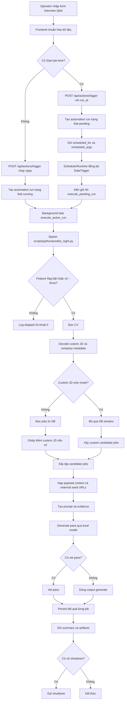

# 10.2 Workflow `predict_interview_qa`

## Mục đích tài liệu

Tài liệu này mô tả workflow hiện tại của subpage `Learning Quiz -> Interview Q&A` và chốt hướng triển khai pipeline crawl + xử lý tối ưu cho máy cấu hình yếu.

Mục tiêu của bản cập nhật này là giữ cùng lúc hai góc nhìn:

1. workflow vận hành hiện tại của action `predict_interview_qa`
2. pipeline kỹ thuật nên triển khai tiếp để giảm CPU, RAM, I/O, và chi phí LLM

Tài liệu tổng quan hệ thống nằm tại:

- [10.1_current_system_explanation.md](d:/5.Thanh/2.automate_updating_CV/docs/10.1_current_system_explanation.md)
- [10.1_current_system_explanation.mmd](d:/5.Thanh/2.automate_updating_CV/docs/10.1_current_system_explanation.mmd)

## 1. Bài toán nghiệp vụ

Subpage `Interview Q&A` phục vụ hai kiểu chạy:

1. `Ad-hoc prediction`: operator nhập nhanh job, CV, JD text, hoặc JD file để chạy ngay
2. `Scheduled prediction`: operator đặt `run_at` để hệ thống chạy sau bằng `automation_runs` + scheduler

Đầu ra kỳ vọng không phải crawl tràn lan, mà là tạo bộ evidence gọn và đáng tin để trả lời:

- công ty làm gì
- sản phẩm hoặc dịch vụ chính là gì
- khách hàng mục tiêu là ai
- nhu cầu thị trường nào đang được phản ánh trong JD
- câu trả lời phỏng vấn nào phù hợp với JD và CV đang dùng

Nguyên tắc vận hành trên máy yếu:

- crawl ít nhưng đúng
- lọc sớm
- chỉ dùng LLM ở bước cuối
- ưu tiên text sạch, tránh render JS hoặc parse PDF sớm

## 2. Input hiện có từ UI

UI hiện có các trường:

- `Job IDs`
- `CV path`
- `Recent days`
- `Max jobs`
- `Start job time`
- `Company name`
- `Company website`
- `JD text`
- `JD file`
- `Force run even when feature flag is off`
- `Shut down when completed`

## 3. Ánh xạ input UI -> payload / args

| Input UI | Chuẩn hóa ở frontend | Đầu ra gửi backend / script | Ghi chú |
|---|---|---|---|
| `Job IDs` | tách dấu phẩy, trim, ép số, bỏ giá trị lỗi | lặp lại `--job-id <id>` | chỉ giữ số dương hợp lệ |
| `CV path` | trim chuỗi | `--cv-path <path>` | để trống thì script dùng mặc định |
| `Recent days` | ép về số nguyên không âm | `--recent-days <n>` | chỉ dùng cho DB window |
| `Max jobs` | ép về số nguyên tối thiểu `1` | `--limit <n>` | chỉ dùng cho DB window |
| `Start job time` | `datetime-local` -> ISO UTC | `run_at` trong payload API | backend tạo pending run nếu có giá trị |
| `Company name` | trim rồi encode base64 | `--custom-company-base64 <encoded>` | gắn metadata rõ cho custom JD |
| `Company website` | trim rồi encode base64 | `--custom-company-website-base64 <encoded>` | backend normalize thành external crawl seed |
| `JD text` | trim rồi encode base64 | `--jd-text-base64 <encoded>` | tránh log raw JD trên command line |
| `JD file` | browser đọc file thành text | hợp nhất vào luồng `JD text` | không đẩy file path thô xuống backend |
| `Force...` | boolean | `--force` | bỏ qua feature gate |
| `Shut down...` | boolean | `--shutdown-when-completed` | cờ vận hành nhạy cảm, phải dùng cẩn thận |

### Runtime meaning of the input groups

- `Company name`, `Company website`, `JD text`, và `JD file` là nhóm input dành cho `custom JD`.
- `Recent days` và `Max jobs` là nhóm input chỉ dùng để chọn job từ DB local.
- `Recent days = 14` có nghĩa là nhìn ngược `14` ngày trong DB, không phải crawl internet `14` ngày.
- `Max jobs = 5` có nghĩa là giới hạn tối đa `5` job DB đi vào batch, không phải `5` website.
- Nếu có `JD text` nhưng không có `Job IDs`, runner chuyển sang `custom JD only mode` và bỏ qua `Recent days` cùng `Max jobs`.

## 4. Workflow vận hành hiện tại



## 5. Các pha xử lý hiện tại

### 5.1 Frontend chuẩn hóa dữ liệu

Frontend thực hiện các bước:

1. chuẩn hóa `Job IDs` thành nhiều cặp `--job-id`
2. thêm `--cv-path` nếu có
3. luôn gửi `--recent-days` và `--limit` sau khi ép kiểu
4. encode `Company name` và `Company website` sang base64 khi có giá trị
5. hợp nhất `JD text` và `JD file` thành text, rồi encode base64 qua `--jd-text-base64`
6. đổi `Start job time` sang `run_at` ISO UTC
7. bật `--force` hoặc `--shutdown-when-completed` theo checkbox

Frontend đồng thời hiển thị hai ghi chú runtime:

- nếu đang ở `custom JD only mode`, UI nhắc rằng `Recent days` và `Max jobs` sẽ bị ignore
- nếu không, UI nhắc rằng hai field này chỉ dùng cho DB window

### 5.2 Backend tạo run và đồng bộ scheduler

Nếu không có `run_at`:

- tạo `automation_run` trạng thái `running`
- ghi `cmd`, `log_path`, metadata runtime
- chạy `execute_action_run(...)`

Nếu có `run_at`:

- tạo `automation_run` trạng thái `pending`
- ghi `scheduled_for`, `scheduled_args`, `cmd`, `log_path`
- để `SchedulerRuntime.sync_jobs()` đăng ký `DateTrigger`

Khi tới giờ:

1. scheduler gọi `execute_pending_run(run_id)`
2. backend đọc lại `scheduled_args`
3. backend đổi `pending -> running`
4. tiếp tục vào luồng `execute_action_run(...)`

### 5.3 Rủi ro pending run bị kẹt

Nếu app restart sau `scheduled_for` nhưng trước khi in-memory trigger được fire:

- run có thể vẫn nằm ở `pending`
- date trigger cũ không còn trong memory
- runtime hiện tại chưa auto-backfill overdue pending runs khi startup lại

Vì vậy UI đang có hai thao tác cứu hộ:

- `Recall`: release pending run ngay
- `Set Time`: cập nhật lại `scheduled_for`

### 5.4 Runtime command và logging

Action `predict_interview_qa` được map thành lệnh dạng:

```text
.venv\Scripts\python.exe scripts\python\predict_night.py <args...>
```

Trong lúc chạy:

- backend tạo file log theo từng run
- stdout được ghi vào file log
- metadata như `progress_message`, `line_count`, `stdout_tail_lines`, `pid` có thể được cập nhật vào `automation_runs.detail_json`
- frontend có thể mở log viewer riêng
- nếu run còn chạy thì log viewer sẽ poll `/api/files/text`

### 5.5 Lightweight external evidence enrichment

`predict_interview_qa` now enriches each job with two lightweight evidence sources before Qwen synthesis:

- payload context already stored in SQLite, such as `about_company`, `about_job`, `description`, and `full_page_text`
- lightweight external pages fetched from non-LinkedIn seed URLs such as external `apply_url`, `company_url`, `company_website`, or URLs carried by a custom JD

The current enrichment path stays lightweight on purpose:

- uses `requests` + `BeautifulSoup`
- respects `robots.txt` when reachable
- follows only a few same-domain links such as `about`, `company`, `services`, `careers`, `jobs`
- caps page count and content size
- caches fetched documents before ranking and LLM

This means the current workflow is no longer limited to JD text and CV only. It can widen the evidence pool with low-cost outside context when the job carries an external company or apply URL.

### 5.6 Custom JD semantics and candidate-job construction

Custom JD now goes through a more explicit construction path:

- `Company name` becomes the `company` label in the synthetic job output instead of the generic `Manual input` fallback when provided
- `Company website` is normalized and stored as `company_website`
- `Company website` is also inserted into `external_seed_urls`
- any `http` or `https` links found inside `JD text` are appended into `external_seed_urls`
- if only custom JD input is present, the runner skips loading recent DB jobs altogether

This keeps the batch small and makes external evidence easier to attribute.

### 5.7 Output artifacts and result contract

Each run now has two output layers.

Batch layer:

- `summary.json`
- `summary.md`
- `events.jsonl`
- generated file list

Per-job layer:

- `job_id`, `title`, `company`, `company_website`, `location`
- `external_seed_urls`
- `source_documents`
- `questions`
- `evidence_chunks`
- `qa`
- `metrics`
- `generated_at`

The prediction detail modal also exposes a client-side `Download TXT` action that concatenates the header, `Q&A Pack`, `Interview Brief`, and `Gap & Drill Plan` into a single `.txt` file on demand. Because it reuses already loaded detail data, it does not add extra prediction-time work.

Expected interpretation:

- `Company name` changes labeling quality in the output
- `Company website` changes both labeling and external crawl provenance
- `Recent days` and `Max jobs` only change which DB jobs are included in the batch
- a valid output can still have empty external pages if JD, CV, or DB payload context were enough
- vet failure should not discard generated Q&A; it should be visible in `metrics`

## 6. Pipeline crawl và xử lý tối ưu cho máy cấu hình yếu

Đây là hướng triển khai kỹ thuật thống nhất cho bước tiếp theo. Mục tiêu là giữ chất lượng evidence nhưng giảm chi phí tài nguyên.

## 6.1 Chia nguồn dữ liệu theo mức ưu tiên

### Nguồn ưu tiên cao, chi phí thấp

- website công ty
- trang giới thiệu sản phẩm hoặc dịch vụ
- trang news hoặc PR
- trang tuyển dụng
- GitHub hoặc app store nếu có

### Nguồn chỉ dùng khi thật cần

- LinkedIn
- Crunchbase
- báo cáo tài chính PDF
- dữ liệu đăng ký doanh nghiệp
- site động phải render JS

Nguyên tắc: không mở Playwright hoặc parser nặng hàng loạt ngay từ đầu.

## 6.2 Crawl theo chiến lược hai tầng

### Tầng A: lightweight crawl

Dùng:

- `requests` hoặc `aiohttp`
- `BeautifulSoup` hoặc `lxml`
- timeout ngắn
- retry ít
- giới hạn số URL và domain

Chỉ lấy:

- `title`
- `meta description`
- `h1` và `h2`
- đoạn text chính
- internal links quan trọng
- timestamp nếu có

Không tải ảnh, không render JS, không parse PDF ở bước này.

### Tầng B: heavy crawl có điều kiện

Chỉ chuyển sang bước nặng khi:

- `requests` không lấy được nội dung có ích
- thông tin quan trọng nằm sau JS
- cần PDF vì không có nguồn text thay thế
- cần thông tin pháp lý hoặc tài chính đặc thù

Lúc đó mới dùng:

- Playwright hoặc Selenium
- PDF parser
- nguồn có rate limit cao hoặc API tốn chi phí

## 6.3 Flow crawl chuẩn cho mỗi URL

Mỗi URL đi qua đúng chuỗi sau:

### Bước 1: kiểm tra quyền crawl

- đọc `robots.txt`
- kiểm tra allow / disallow
- cache rule theo domain
- đặt delay theo domain

### Bước 2: tải HTML thô

- dùng user-agent rõ ràng
- timeout 10 đến 20 giây
- retry exponential backoff
- gặp `429` thì tôn trọng `Retry-After`

### Bước 3: trích xuất text tối thiểu

- bỏ `script`, `style`, `nav`, `footer`
- lấy `title`, heading, main text
- lấy canonical URL
- lấy internal links quan trọng

### Bước 4: lưu raw + parsed

Lưu hai lớp:

- `raw_html`
- `parsed_text` hoặc `parsed_json`

### Bước 5: chấm điểm sơ bộ

Ví dụ:

- có tên công ty không
- có mô tả sản phẩm không
- có dấu hiệu khách hàng hoặc ngành không
- text có đủ dài không

Nếu điểm thấp thì loại sớm, không cho vào NLP hoặc LLM.

## 6.4 Tiền xử lý văn bản: rẻ trước, nặng sau

Không đưa toàn bộ text vào model ngay. Tách thành ba lớp:

### Lớp 1: clean text

- chuẩn hóa UTF-8
- bỏ ký tự rác
- bỏ HTML thừa
- chuẩn hóa khoảng trắng
- cắt text quá dài

### Lớp 2: rule-based extraction

Dùng regex hoặc keyword rules để lấy nhanh:

- tên công ty
- sản phẩm
- ngành
- địa chỉ
- email hoặc phone công khai
- các cụm như `khách hàng`, `đối tác`, `giải pháp`, `nền tảng`, `dịch vụ`

### Lớp 3: chỉ phần khó mới dùng NLP

Ví dụ:

- NER
- topic clustering
- key sentence extraction
- coarse summarization

## 6.5 Kiến trúc hai tầng: heuristic hoặc light model trước, Qwen sau

Luồng đề xuất:

1. rule-based scoring hoặc light ranking
2. lấy top evidence
3. chỉ khi đã đủ context mới gọi Qwen để tổng hợp câu trả lời cuối

Điều này giúp:

- giảm prompt size
- giảm thời gian local inference
- giảm khả năng model trả lời lan man

## 6.6 Thiết kế dữ liệu trung gian nhỏ

Không nên lưu mọi thứ ở dạng blob lớn trong hot path. Nên giữ các lớp sau:

- document metadata
- parsed text rút gọn
- evidence chunks
- ranked question candidates
- final Q&A output

Với custom JD, cần nhìn rõ provenance:

- website nào đi vào `external_seed_urls`
- document nào thực sự đi vào `source_documents`
- chunk nào thực sự được dùng trong `evidence_chunks`

## 6.7 Tối ưu tài nguyên hệ thống

Ưu tiên tối ưu theo thứ tự:

1. user-facing latency
2. prompt efficiency
3. duplicate work reduction
4. local LLM stability
5. queue và batch control
6. storage / I/O safety

Điểm tối ưu đang đúng hướng:

- custom-JD-only mode tránh load nhầm DB jobs
- external pages được cache trước khi vào ranking và LLM
- evidence được rút gọn trước khi build prompt
- vet failure không làm mất kết quả generate

## 6.8 Storage phù hợp cho máy yếu

Storage hiện tại và hướng dùng hợp lý:

- SQLite cho metadata, cache, và run tracking
- JSON / JSONL cho output artifacts và event log
- gzip raw HTML nếu cần lưu thô

Nguyên tắc:

- không để raw crawl lớn nằm trong hot path của UI
- không ép mọi dữ liệu sang DB nếu chỉ cần artifact file

## 6.9 Scheduling tối ưu

Scheduled prediction nên giữ logic đơn giản:

- pending run chỉ lưu đủ `scheduled_for`, `scheduled_args`, và metadata
- khi tới giờ mới đọc lại job, CV, và input custom
- nếu run quá hạn mà chưa fire, operator dùng `Recall` hoặc `Set Time`

## 6.10 Metrics tối giản nhưng đủ dùng

Ít nhất nên theo dõi:

- `job_count`
- `custom_job_count`
- `db_job_count`
- `completed_jobs`
- `failed_job_count`
- `generate_total_ms`
- `vet_total_ms`
- `prompt_chars`
- `source_document_count`
- `external_seed_url_count`

Mục tiêu là đủ để trả lời:

- batch có bị lẫn job ngoài ý muốn không
- external evidence có thực sự được dùng không
- prompt có đang phình to không
- local model đang chậm ở generate hay vet
