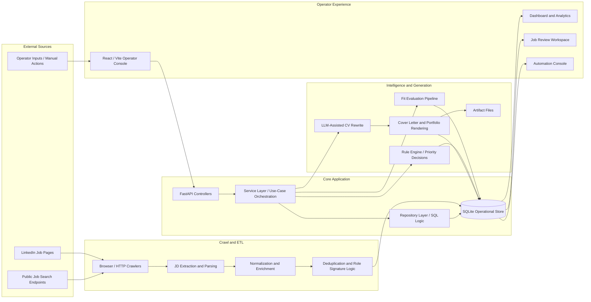
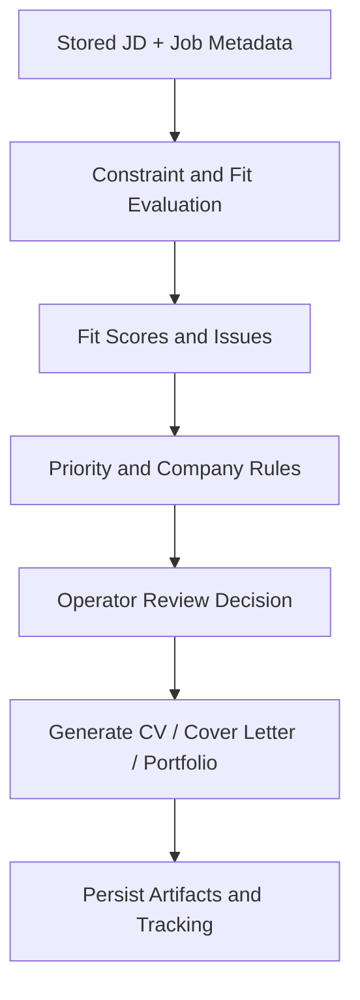

# Project Architecture Overview

This document is intentionally written at a **showcase level**. It is meant to communicate the structure, engineering direction, and main runtime flows of the project without exposing sensitive implementation details.

## System Goal

Job Ops Console is a workflow-oriented application for managing a job-search process end to end:

- collecting job data from external sources
- normalizing and storing observations
- reviewing jobs through an operator console
- evaluating CV fit against JD content
- generating tailored application artifacts
- tracking application outcomes over time

The project is not just a CRUD dashboard. Its core value comes from combining **automation**, **data processing**, and **LLM-assisted artifact generation** into one operational workflow.

## High-Level Architecture



## Main Architectural Areas

### 1. Crawl and Ingestion

The first part of the system is responsible for collecting job data from public job pages and search results.

Main responsibilities:

- fetching job cards and detail pages
- handling multiple extraction paths when page structure varies
- recovering JD text from richer HTML blocks or metadata
- storing repeated observations over time instead of a single flattened snapshot

This layer is important because downstream evaluation quality depends directly on JD quality. A weak or partial JD leads to weaker fit scoring and weaker generated artifacts.

### 2. Normalization and Persistence

After crawl, the data is normalized and written into an operational SQLite store.

Main responsibilities:

- canonicalizing job URLs and job IDs
- building role signatures for deduplication
- extracting work model and employment type
- storing observation history, JD content, fit scores, and application tracking

The persistence model is intentionally operational rather than purely analytical. It is designed to support repeated review, incremental updates, and artifact linking from the UI.

### 3. API and Use-Case Layer

The backend uses a layered structure:

- **controller layer**
  - HTTP boundary, validation, parameter parsing
- **service layer**
  - workflow coordination and cross-component orchestration
- **repository layer**
  - SQL-heavy reads, writes, sorting, and inference logic

This separation keeps the request handlers thin while allowing business workflows to be reused and evolved independently.

## Intelligence and Decision Flow



### 4. Evaluation and Rule Engine

This part of the system turns raw job data into decision support.

Main responsibilities:

- evaluating CV-to-JD fit
- surfacing strengths, gaps, and main issues
- inferring effective rules such as company-level restrictions
- helping determine whether a job should be applied, deprioritized, or reviewed manually

This is where the project shifts from data collection into practical workflow intelligence.

### 5. LLM-Assisted Generation

The artifact generation layer blends deterministic rendering with a controlled RAG/LLM pipeline described in `docs/rag_workflow_v1.md`.

Main responsibilities:

- rewriting CV content using the JD analyzer -> evidence mapper -> planner -> generator flow so each bullet cites explicit evidence IDs and observes the JSON contract.
- generating cover letters and supporting portfolio content while enforcing mandatory cover-letter guards, fallback templates, and quality validators.
- tying outputs to job records and artifact sets while embedding schema/prompt/retrieval metadata into `job_generated_artifact_sets`, rendered files, and logs for traceability.
- orchestrating hybrid retrieval (semantic + keyword + metadata scoring) for the offline qwen2.5 gateway, rerouting low-confidence or unsupported queries into deterministic fallbacks.
- keeping a structured pipeline from text preparation through final PDF/DOCX outputs with validators and no-op guards ensuring `cv_enhanced` flags only pass with measurable diff/coverage improvements.

The LLM operates inside this controlled workflow; prompt construction, evidence normalization, fallback templates, persistence, state transitions, and observability hooks are all managed by the surrounding pipeline referenced in the RAG document.

### 5.1 RAG + Offline LLM Flow (showcase-ready)

This new architecture note explicitly showcases yesterday's RAG + offline LLM work:

- **Layered flow:** query processor -> intent classifier -> retriever -> reranker -> generator -> validator -> persistence/audit loop, with metadata (routing reason, score breakdown, validator failure) captured per transition.
- **Evidence guards:** confidence scoring, coverage deltas, diff thresholds, and no-op checks gate retries, fallback routes, and `cv_enhanced` updates so every output is evidence-backed.
- **Hybrid retrieval filters:** location, visa, seniority, and freshness filters run before reranking; the scoring mix (semantic 55%, keyword 30%, metadata 15%) keeps retrieval fair yet precise.
- **Retry/fallback hierarchy:** structured prompt variants (full, retry, fallback) with token budgets, deterministic template fallbacks, and minimal-safe outputs keep the pipeline resilient on CPU-bound hardware.
- **Structured contracts:** JSON outputs include `jd_analysis`, `evidence_map`, `fit_assessment`, `cv_rewrite`, `cover_letter`, and `quality_checks`, with validator-driven flags such as `cv_enhanced` and `cover_letter_present`.

This explicit layer makes the retrieval, generation, and validation work visible while still masking sensitive internals, which is ideal for showcasing the new RAG + LLM capabilities.

### 6. Operator Console

The frontend is designed as an operator console rather than a marketing-style interface.

Main responsibilities:

- dashboard metrics and maps
- applied-job trend analysis
- job detail review with fit context
- CV preview and artifact access
- manual and automated workflow controls

The emphasis is on fast review, operational clarity, and keeping all job actions in one place.

## Simplified End-to-End Runtime Flow

```text
1. Crawl jobs from public sources
2. Extract and normalize job/JD content
3. Store observations and derived fields in SQLite
4. Surface jobs in the operator console
5. Evaluate fit and apply rules
6. Generate CV / cover letter / portfolio artifacts when needed
7. Persist artifacts and update tracking status
8. Continue review and automation from the same console
```

## Design Approach

The project intentionally applies a few recognizable engineering patterns:

- **Layered architecture**
  - controller -> service -> repository
- **Repository pattern**
  - SQL and persistence logic stay isolated from the API boundary
- **Pipeline-style processing**
  - crawling, evaluation, and generation happen in explicit stages
- **Rule-based decision layer**
  - effective job/company constraints are computed centrally
- **Artifact-oriented workflow**
  - generated files are versioned, linked, and reused through the application lifecycle

These choices make the system easier to scale in complexity without collapsing all logic into one script or one controller.

## Showcase Scope

This architecture note is intentionally limited to a presentation-level overview.

It does not attempt to expose:

- private infrastructure details
- complete automation internals
- full prompt design and evaluation heuristics
- sensitive operational code paths

If needed, a deeper technical walkthrough can be shared separately in a controlled setting.
