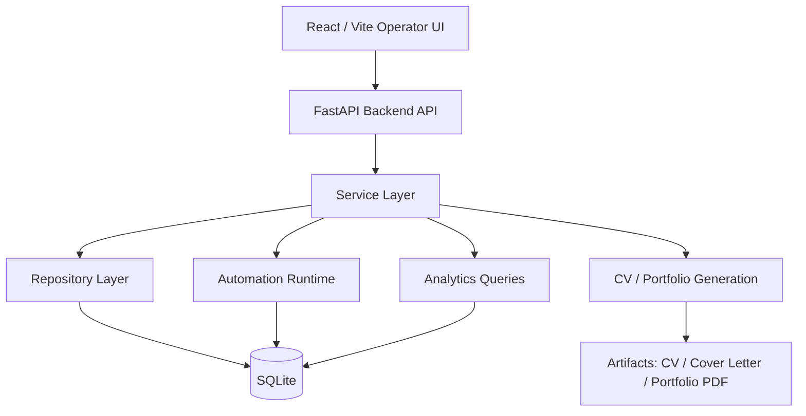

# Project Architecture Overview

This document is intentionally written at a **showcase level**. It is meant to present the structure and engineering direction of the project without exposing operationally sensitive details.

## System Goal

Job Ops Console is a workflow-oriented application designed to centralize:

- job collection
- filtering and prioritization
- fit evaluation
- CV and portfolio artifact generation
- application tracking
- operator-facing analytics and automation

The project is intentionally practical: it focuses on repeatable workflow execution rather than a purely demo-oriented UI.

## Architecture Diagram



## Layered Design

### 1. Presentation Layer

The frontend acts as an operator console for reviewing and acting on job data.

Main responsibilities:

- dashboard summaries
- jobs filtering and review
- analytics screens
- automation controls
- artifact preview

The UI is designed for operational clarity, with persistent filters and direct action flows.

### 2. API Layer

The FastAPI layer exposes a thin HTTP boundary around the application workflow.

Typical responsibilities:

- parameter parsing
- request validation
- endpoint composition
- response shaping

This layer is intentionally kept thin so that business logic remains testable and reusable in services.

### 3. Service Layer

The service layer coordinates use cases such as:

- list/detail job workflows
- CV artifact enrichment
- rewrite-render execution
- post-generation persistence
- automation orchestration

This is where workflow decisions are composed across multiple lower-level components.

### 4. Repository Layer

The repository layer encapsulates persistence and SQL-heavy logic.

Main responsibilities:

- job listing queries
- filtering and sorting
- inferred rule evaluation
- application tracking persistence
- schedule and run history persistence

This keeps data access logic centralized and separate from HTTP and UI concerns.

### 5. Automation and Generation Layer

This layer covers the operational workflows that make the project distinctive:

- crawl execution
- scheduled actions
- fit evaluation
- CV rewrite flow
- cover letter generation
- portfolio artifact generation

This layer combines deterministic file handling with LLM-assisted content generation where appropriate.

## Design Approach

The current project structure intentionally follows a few recognizable engineering patterns:

- **Layered architecture**
  - controller -> service -> repository
- **Repository pattern**
  - SQL and persistence stay isolated from request handlers
- **Pipeline-style processing**
  - generation flows are organized in stages
- **Rule-based decision layer**
  - priority flags and company constraints are computed centrally

These choices make the project easier to evolve without tightly coupling the UI, API, and persistence logic.

## Simplified Runtime Flow

```text
1. Job data is collected or refreshed
2. Data is normalized and stored
3. Operators review jobs through the UI
4. Fit evaluation or artifact generation can be triggered
5. Generated artifacts are linked back to job records
6. Tracking and automation continue from the same console
```

## Showcase Scope

This architecture note is intentionally limited to a high-level presentation.

It does not attempt to document:

- internal deployment details
- full automation behavior
- infrastructure secrets
- complete production implementation

If needed, a deeper technical walkthrough can be shared separately in a controlled setting.
